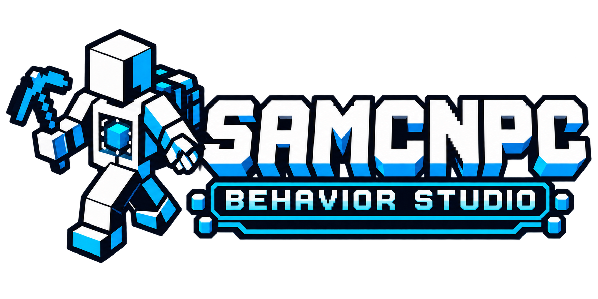
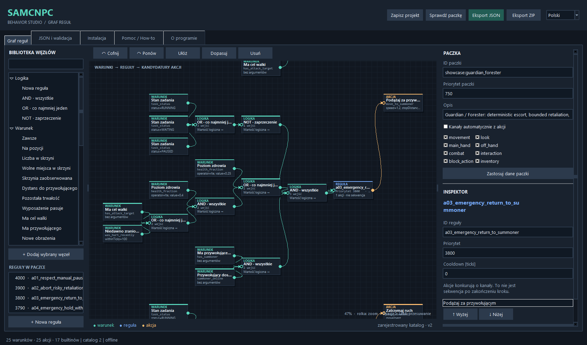

<p align="center">
  
</p>

# SAMCNPC Behavior Studio

[English](README.md) | [Polski](README_PL.md) | Deutsch

**Ein visueller Offline-Editor für deterministische NPC-Verhaltenspakete — SAMCNPC für Minecraft Forge 1.20.1.**

Bedingungen und Aktionen verbinden, erzeugtes JSON prüfen, den Graphen validieren und
das Pack in einer Minecraft-Instanz installieren. Studio **1.2.0** bietet einen dunklen
Knoteneditor, EN/PL/DE-Oberfläche, Beispiele und drei bebilderte GitHub-Handbücher.
Zum Bearbeiten eines Packs sind keine Programmierkenntnisse nötig.

[SAMCNPC Core](https://github.com/DasIstEin20/SAMCNPC_Core) stellt Körper und Mechanik bereit;
[SAMCNPC Behavior](https://github.com/DasIstEin20/SAMCNPC_Behavior) führt Regeln und dauerhafte Aufgaben aus.
Studio erstellt ihre Daten. Der Editor funktioniert ohne Minecraft, LLM, API-Schlüssel oder Cloud-Dienst.

## Funktionen

- Dunkler Editor für Bedingungen, `all` / `any` / `not`, Regeln und Aktionen mit Prioritäten,
  Cooldown und ausdrücklichen Aktionskanälen.
- `.samgraph`-Projekte im kompatiblen Format 1, JSON-Import, Rückgängig und Exportvorschau.
- Aus dem registrierten Schema erzeugte Felder: Typen, Grenzen, Auswahlwerte, Beschreibungen,
  Vorgaben und Kanäle. Aktuell **25 Bedingungen, 25 Aktionen und 17 eingebaute Pack-Referenzen**.
- Inventarmengen, freie Plätze, Ausrüstung/Haltbarkeit, erlaubte Truhenbeobachtungen,
  Position, Aufgabenstatus, Fehlergründe und `ensure_equipment`.
- Englisch als Standard; Wechsel zwischen EN/PL/DE im vorhandenen Fenster ohne Verlust
  von Graph, Auswahl, Entwürfen oder Verlauf.
- Validierung, JSON-/ZIP-Export, Instanzauswahl, Prüfung doppelter IDs und Sicherung
  beim bestätigten Überschreiben.
- Hilfe/Über, Übungsprojekte und ein fortgeschrittenes Beispiel mit 506 Knoten.

Ein Graph beschreibt **Bedingungen → Regel → Aktionskandidaten**. Verbindungen sind kein
Programm, das Schritt für Schritt ausgeführt wird. Behavior entscheidet anhand von
Prioritäten und belegten Kanälen. Werkzeugbeschaffung aus einer Truhe und Fortsetzung
längerer Arbeit nutzen vorhandene dauerhafte Aufgaben. JSON/ZIP erzeugt weder neue
Algorithmen noch Code, Befehle oder Truhenberechtigungen.

## Start

Erforderlich: **Python 3.10+ mit Tkinter/Tcl/Tk** und grafischem Desktop.
Der Editor verwendet nur die Standardbibliothek; `pip install` ist nicht nötig.

```powershell
git clone https://github.com/DasIstEin20/SAMCNPC_Behavior_Studio.git
cd SAMCNPC_Behavior_Studio
.\START_WINDOWS.bat
```

Alternativ `python studio.py`, unter Linux/macOS `python3 studio.py` ausführen.
Java, Forge, Git-Submodule oder benachbarte SAMCNPC-Quellcodeverzeichnisse werden für den Editor nicht benötigt.

1. Über **Datei → Öffnen** das [Folgebeispiel](examples/custom/example_follow.samgraph) laden.
2. Einen Parameter ändern, übernehmen, den Graphen prüfen und die JSON-Vorschau ansehen.
3. `.samgraph` für spätere Bearbeitung speichern und anschließend JSON oder ZIP exportieren.

Im Spiel werden passende Core- und Behavior-Builds sowie Kotlin for Forge auf Minecraft
Forge **1.20.1** benötigt. Behavior muss den mitgelieferten **Katalog 2** und externe ZIPs
unterstützen. Pack-Schema/Semantik bleiben bei Version **1**. Eine gleiche Versionsnummer
auf Entwicklungs-JARs allein garantiert keine Kompatibilität; den jeweiligen Katalog prüfen.

## Handbücher

| English | Polski | Deutsch |
| --- | --- | --- |
| [Read the guide](tutorials/GUIDE_EN.md) | [Czytaj poradnik](tutorials/GUIDE_PL.md) | [Handbuch lesen](tutorials/GUIDE_DE.md) |

Drei Markdown-Seiten ersetzen die sechs PDF-Varianten White/Black. GitHub verwendet das
gewählte helle oder dunkle Design. Jedes Handbuch enthält die **20 ursprünglichen Kapitel**,
Befehle, echte Screenshots und ein anklickbares Inhaltsverzeichnis sowie ein zusätzliches
Kapitel über Guardian / Forester.

Themen: Regeln, Inventar, Ausrüstung, exakte Gegenstände und Rollen, Truhen, sicheres
Entladen, Prioritäten, Kanalkonflikte, ZIP-Export, Installation und Fehlersuche. Die praktische
Übung zeigt „NPC benötigt Werkzeug → holt es aus einer erlaubten Truhe → rüstet es aus →
arbeitet“. Die [Übungsprojekte](tutorials/examples/) sind enthalten.

## Beispiele

- [Folgen](examples/custom/example_follow.samgraph), [vorsichtiges Folgen](examples/custom/example_cautious_follow.samgraph)
  und [Vergeltung](examples/custom/example_retaliate.samgraph).
- [Werkzeugvorbereitung](examples/custom/example_tool_preparation.samgraph): eine bereits getragene brauchbare Axt ausrüsten.
- [Guardian / Forester](examples/advanced/guardian_forester/guardian_forester.samgraph): **33 Regeln, 506 Knoten, 473 Verbindungen**
  für Sicherheit, Vergeltung, Ausrüstung, dauerhafte Logistik und Eskorte.

Das fortgeschrittene Beispiel enthält JSON/ZIP, eine [polnische Anleitung](examples/advanced/guardian_forester/README_PL.md)
und [Spieltest-Ergebnisse](examples/advanced/guardian_forester/VALIDATION.md). Über **Datei → Öffnen** laden.
Das Pack allein erstellt weder einen Arbeitsauftrag noch eine Truhenfreigabe.



## Export und Installation

Nach der Prüfung JSON oder ZIP exportieren. Im Register Installation den **Hauptordner der
Minecraft-Instanz** wählen. Studio erstellt den passenden Zielpfad:

| Format | Ziel |
| --- | --- |
| JSON | `<Instanz>/config/samcnpc/behaviors/<Name>.json` |
| ZIP | `<Instanz>/resources/samcnpc/behaviors/<Name>.zip` — nicht entpacken |

ZIP enthält `behaviors/<Name>.json` und Installationshinweise. Es ist eine externe
SAMCNPC-Ressource, kein Vanilla-Ressourcenpaket oder Datapack. `.samgraph` separat speichern.
Im Mehrspielermodus müssen die Dateien in die **Serverinstanz** gelangen.

Jede Pack-ID darf nur eine aktive Quelle haben; nicht gleichzeitig JSON und ZIP derselben
ID installieren. Überschreiben braucht eine Bestätigung und bewahrt eine Sicherung.
Nach Installation des Werkzeugbeispiels im Spiel:

```text
/samcnpc behavior reload
/samcnpc behavior packs
/samcnpc behavior assign Sam example:tool_preparation
/samcnpc behavior diagnostics Sam
```

`Sam` durch den NPC-Namen ersetzen. Reload benötigt Operatorrechte; NPC-Operationen prüfen
Beschwörer-/Operatorrechte. `assign` ersetzt die Pack-Liste, daher benötigte Controller
aktiver Aufgaben beibehalten. Ein fehlgeschlagener Reload erhält den letzten gültigen Bestand.
Details: [ZIP-Format und Grenzen](docs/EXTERNAL_BEHAVIOR_ZIPS.md).

## Katalog und Gegenstandsabfragen

Das verbindliche [registrierte Schema](vendor/behavior-pack-registered.schema.json) ist enthalten.
**Datei → Registrierten Katalog laden** akzeptiert ein kompatibles Behavior-Schema aus `contracts`.
Fehlerhafte Kandidaten ersetzen den aktiven Katalog nicht. Die Aktualisierung gilt für diese
Sitzung; vor Export erneut validieren. Für eine Aktualisierung des mitgelieferten Katalogs:

```text
python make_catalog.py <Repository-oder-Schemapfad>
python make_schema.py
```

`minecraft:coal` schließt Holzkohle aus; `@axe` verwendet die verbindliche Axt-Rolle;
`minecraft:coal|minecraft:charcoal` erlaubt ausdrücklich beide. `ensure_equipment` wählt
getragene Ausrüstung. Truhenbeschaffung und Entladen benötigen erlaubte dauerhafte Operationen
und eine ausdrückliche Richtlinie. Unbekannter Truhenbestand ist nicht null.
[Beschreibung der Verträge](docs/LOCAL_AUTONOMY.md).

## Prüfung

Im Hauptordner dieses Repositorys ausführen:

```text
python -m unittest discover -s tests -v
python cli.py examples/custom/example_follow.samgraph --json-out follow.json --zip-out follow.zip
```

GUI-Tests benötigen einen Desktop; unter Linux ohne Bildschirm Xvfb verwenden. Das CLI
importiert Tkinter nicht. Der [datierte Bericht](docs/TEST_REPORT.md) trennt die Prüfung dieses
Pakets von früheren Forge-/Client-Ergebnissen. Studio prüft Graph-Verträge; physische Ergebnisse
müssen über Reload und Tests in Minecraft bestätigt werden. Das Test-ZIP ist enthalten,
daher ist kein benachbartes Behavior-Quellcodeverzeichnis nötig.

## Lizenz

[MIT](LICENSE).
