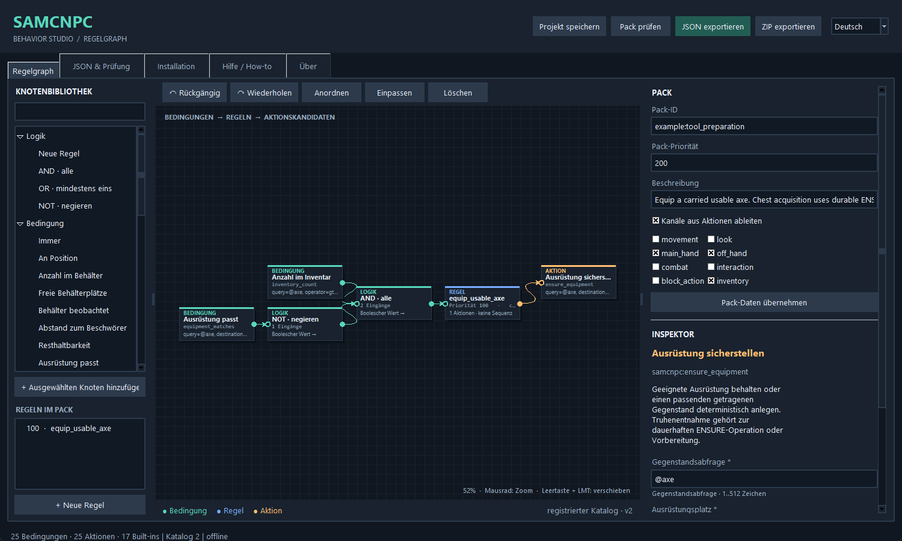
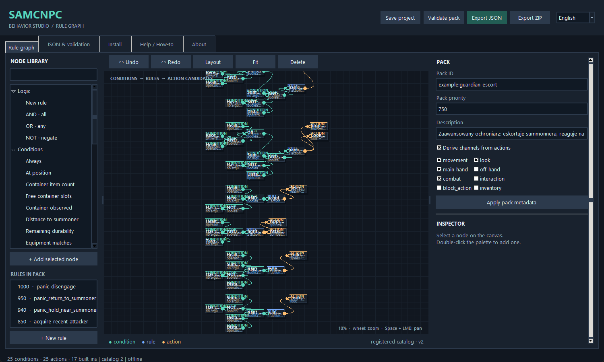
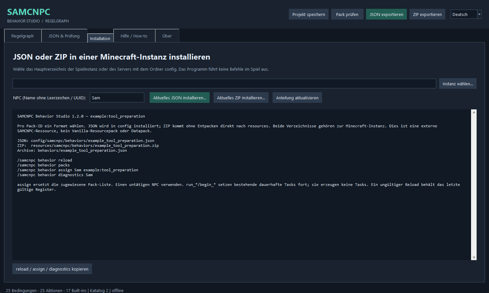

# SAMCNPC Behavior Studio 1.2.0 — Eigene Verhaltenspakete erstellen

[English](GUIDE_EN.md) | [Polski](GUIDE_PL.md) | Deutsch

[Zurück zu Studio](../README_DE.md)

Dieses GitHub-Handbuch ersetzt die PDF-Varianten White und Black. GitHub verwendet das gewählte helle oder dunkle Design; Anleitung und Beispiele bleiben gleich. Programmierkenntnisse sind nicht erforderlich.

<a id="contents"></a>

## Inhalt

1. [Mit einem sicheren Test beginnen](#chapter-1)
2. [Den Editor verstehen](#chapter-2)
3. [Bedingungen, Regeln und Aktionen](#chapter-3)
4. [Übung: Folgen und Vorsicht](#chapter-4)
5. [Prioritäten, Kanäle und Vergeltung](#chapter-5)
6. [Ein großer Graph: Guardian Escort](#chapter-6)
7. [Exakte Gegenstände und ausdrückliche Kategorien](#chapter-7)
8. [Inventar- und Ausrüstungsdaten](#chapter-8)
9. [Einen geeigneten getragenen Gegenstand ausrüsten](#chapter-9)
10. [Truhen beobachten: unbekannt ist nicht leer](#chapter-10)
11. [Vorübergehende Regeln und dauerhafte Aufgaben](#chapter-11)
12. [Tutorial: Werkzeug aus einer erlaubten Truhe](#chapter-12)
13. [Nach der Vorbereitung Holzarbeit fortsetzen](#chapter-13)
14. [Platz, Reserven und verschlissene Werkzeuge](#chapter-14)
15. [Position, Aufgabe und Fehlerbedingungen](#chapter-15)
16. [Speichern, Vorschau und ZIP-Export](#chapter-16)
17. [In der Minecraft-Instanz installieren](#chapter-17)
18. [Neu laden und das tatsächliche Ergebnis prüfen](#chapter-18)
19. [Katalog aktualisieren und Fehler beheben](#chapter-19)
20. [Probleme im Spiel und Referenzen](#chapter-20)
21. [Fortgeschrittenes Beispiel: Guardian / Forester](#chapter-21)

<a id="chapter-1"></a>

## 1. Mit einem sicheren Test beginnen

Studio 1.2.0 ist ein Offline-Editor für SAMCNPC Behavior. Er benötigt Python 3.10+ mit Tkinter; für den Editor sind keine pip-Pakete nötig. START\_WINDOWS.bat starten oder python studio.py im Programmordner ausführen.

Die Standardsprache ist Englisch. Oben rechts oder im Menü Language stehen Polski, English und Deutsch bereit. Der Wechsel übersetzt vorhandene Steuerelemente und erhält Graph, noch nicht übernommene Felder, JSON-Entwurf, Auswahl, Verlauf und Ansicht.

In einer Weltkopie mit passenden Core- und Behavior-Mods für Forge 1.20.1 testen. LLM ist optional. Die Beispiele verwenden einen kontrollierbaren NPC namens Sam. Den tatsächlichen Namen oder bei Mehrdeutigkeit die UUID einsetzen.

Eigene .samgraph-Projekte behalten. Diese Aktualisierung benötigt keine Projektmigration. Eigene Arbeit nicht durch mitgelieferte Beispiele überschreiben.

Öffnet sich kein Fenster, im Terminal zuerst py -3 -m tkinter und danach py -3 studio.py ausführen. Fehlermeldungen und Diagnoseprotokoll für einen Fehlerbericht aufbewahren.

[Inhalt](#contents)

<a id="chapter-2"></a>

## 2. Den Editor verstehen



Links stehen registrierte Bedingungen, Aktionen und Logikknoten. Nach Name oder stabiler Komponenten-ID suchen; ein Doppelklick fügt einen Knoten hinzu. Die Regelliste hilft bei großen Graphen.

In der Mitte liegt die dunkle Zeichenfläche. Knoten mit der linken Taste ziehen; Ansicht mit der mittleren Taste oder Leertaste+Ziehen verschieben. Mausrad zoomt, F passt den Graphen ein. Delete entfernt die Auswahl. Ctrl+Z / Ctrl+Y machen Änderungen rückgängig und wiederholen sie.

Rechts stehen Pack-Metadaten und der Inspektor des ausgewählten Knotens. Beide besitzen eine eigene Übernehmen-Schaltfläche. Für weitere Parameter nach unten scrollen. Pflichtfelder sind markiert; Grenzen, Auswahlwerte und Vorgaben stammen aus dem Katalog.

Oben: Projekt speichern, prüfen, JSON oder ZIP exportieren. Weitere Register zeigen JSON und Validierung, Installation, Hilfe und Über. Die Position eines Knotens verändert nur die Darstellung, niemals die Aktionspriorität.

[Inhalt](#contents)

<a id="chapter-3"></a>

## 3. Bedingungen, Regeln und Aktionen

Ein typischer Graph lautet Bedingung -&gt; AND/OR/NOT -&gt; Regel -&gt; Aktion. Ausgang auf Eingang ziehen. Eine Regel erhält einen Bedingungsbaum und 1..16 Aktionskandidaten. AND/OR verbinden 1..16 Bedingungen; NOT hat genau einen Eingang.

AND verlangt alle Eingänge, OR mindestens einen, NOT kehrt das Ergebnis um. Die Knoten beschreiben eine Prüfung. Verbindungen übertragen keine Ausführung von Aktion zu Aktion. Ein Fehler startet im selben Tick keinen automatischen else-Zweig.

Beispiel: has\_summoner AND distance\_to\_summoner gt 8 macht eine Folgeregel zulässig. Die Aktion wird bei späteren Auswertungen erneut betrachtet; sie ist kein einmaliger Befehl entlang eines Drahtes.

Jede Regel braucht eine eigene ID. Verwaiste Knoten vor dem Export verbinden oder entfernen. .samgraph darf einen unfertigen Aufbau speichern; ein Runtime-Export muss die Prüfung bestehen.

Nach dem Übernehmen die JSON-Vorschau prüfen. Sie zeigt das tatsächliche Pack ohne reine Editor-Koordinaten.

[Inhalt](#contents)

<a id="chapter-4"></a>

## 4. Übung: Folgen und Vorsicht

Das Beispiel Folgen öffnen. Pack-ID auf tutorial:follow ändern, damit sie nicht mit samcnpc:follow\_summoner kollidiert. has\_summoner und move\_to\_summoner über die Regel verbunden lassen.

Im Aktionsinspektor startDistance 8 und stopDistance 2 setzen; der Startabstand muss größer sein. Für fortlaufende Bewegung cooldown 0 lassen. Studio die erforderlichen Kanäle automatisch wählen lassen. Knoten- und Pack-Änderungen übernehmen, prüfen und tutorial\_follow.samgraph speichern.

Ein Format exportieren und installieren, im Spiel neu laden und tutorial:follow zuweisen. Auf freiem Gelände weggehen, zurückkommen und das Anhalten beobachten. Gewinnt eine andere Bewegungsregel, die Diagnose prüfen.

Für vorsichtiges Folgen das mitgelieferte Beispiel öffnen. AND verbindet den Beschwörer-Test mit health\_fraction, Operator gt, Wert 0.35. Änderungen übernehmen und JSON vor dem Export prüfen.

Knapp oberhalb und unterhalb von 35% Gesundheit testen. Eine deaktivierte Folgeregel ist weder Heilung noch eine sichere Fluchtroute. Erst das erwartete Verhalten festlegen, dann mit dem Spiel vergleichen.

[Inhalt](#contents)

<a id="chapter-5"></a>

## 5. Prioritäten, Kanäle und Vergeltung

Zuerst gewinnt die höhere Regelpriorität, danach die höhere Pack-Priorität. Gleichstände verwenden Pack-ID, Regel-ID und Aktionsreihenfolge. Die Position im Graphen entscheidet nie. Eine Aktion erhält alle erforderlichen Kanäle oder keinen.

movement und look steuern Bewegung und Blick. main\_hand, off\_hand und combat koordinieren Ausrüstung und Kampf. interaction, inventory und block\_action betreffen weitere Tätigkeiten. Ein ausgewählter Kanal erlaubt keine erfundene Aktion.

Ein bedingungsloses stop\_movement mit Priorität 500 kann Folgen mit 100 verdrängen. ensure\_equipment belegt inventory und beide Hände und kann mit Kampf oder Aufgaben kollidieren. Die Bedingung sollte nach erfolgreichem Ausrüsten nicht mehr zutreffen. Hände nicht fortlaufend neu belegen, wenn ein anderer Controller sie benötigt.

Cooldown verschiebt die nächste Prüfung nach einer angenommenen/erfolgreichen Aktion; es ist weder Aktionsdauer noch Warteknoten. Fortlaufende Bewegung und run\_\*-Controller behalten normalerweise 0.

Das Vergeltungsbeispiel zeigt Zielwahl und Angriff als getrennte Regeln. Mit einem kontrollierten Angreifer in einer Weltkopie testen. Vergeltung beweist nicht, dass jede Gefahr für den Beschwörer erkannt wird.

[Inhalt](#contents)

<a id="chapter-6"></a>

## 6. Ein großer Graph: Guardian Escort



[`examples/complex_guardian_escort.samgraph`](examples/complex_guardian_escort.samgraph) aus diesem Handbuchpaket öffnen. Das vorhandene Projekt besitzt 9 Regeln, 80 Knoten und 71 Verbindungen. Es bleibt mit Studio 1.2.0 kompatibel. Links eine Regel auswählen und ihren Bereich vergrößern.

Gruppen: Kampf lösen/Rückkehr (1000, 950, 940), Vergeltung (850, 800), Eskorte (500, 350, 300), sicheres Warten ohne Spieler/Ziel (100). Erst Gruppen, dann einzelne Verbindungen lesen.

Der Panikzweig verbindet geringe Gesundheit mit einem kürzlichen Treffer. clear\_attack\_target und stop\_movement können auf getrennten Kanälen gemeinsam laufen. Andere Regeln sehen die Zieländerung bei einer späteren Auswertung.

Zwei Prüfübungen: Die Folgeregel endet nahe Abstand 8, obwohl die Aktion stopDistance 3.5 hat; kein Endabstand von 3.5 versprechen. Die Vergeltungsprüfung verlangt nur mehr als 22% Gesundheit. Ein Treffer bei 22–35% kann deshalb Zielwahl und Ziellöschung abwechseln lassen. Kampf versuchsweise mit NOT der vollständigen Panikbedingung absichern.

Dies ist ein Lernbeispiel, keine nachgewiesene Schutz-KI. Lokale Validierung beweist kein sinnvolles Spielverhalten. Gesundheitsgrenzen, Ablauf kürzlicher Treffer und Abstandswechsel testen.

[Inhalt](#contents)

<a id="chapter-7"></a>

## 7. Exakte Gegenstände und ausdrückliche Kategorien

Ein Abfragefeld beschreibt den Bedarf. minecraft:coal wählt nur Kohle. Holzkohle im Inventar erfüllt diese Anforderung nicht, obwohl beide Brennstoff sind. Breitere Bedeutung muss ausdrücklich sein: minecraft:coal|minecraft:charcoal erlaubt beide.

@axe wählt von Core als Äxte erkannte Werkzeuge; @pickaxe, @shovel und @hoe funktionieren entsprechend. Weitere Rollen: @food, @placeable\_block, @tool, @shield, @armor, @melee\_weapon, @ranged\_weapon und @ammunition.

Die Rolle stammt aus verbindlichen Gegenstandsdaten, nie aus Namensraten oder einem LLM. Eine Abfrage enthält einen Gegenstand/eine Rolle oder 2..8 unterschiedliche, durch | getrennte Alternativen ohne Verschachtelung. Höchstens 512 Zeichen; eine exakte ID höchstens 128.

Beliebige Tag-Abfragen gibt es in dieser Ausgabe nicht. Keine URL, Befehle, Klassen oder Skripte eingeben. Der Inspektor prüft die unterstützte Syntax vor dem Export.

Exakte IDs verwenden, wenn die Identität zur Aufgabe gehört. Eine Rolle nur wählen, wenn jedes physisch geeignete Mitglied akzeptabel ist. Kategorien erlauben keine zusätzliche Quelltruhe.

[Inhalt](#contents)

<a id="chapter-8"></a>

## 8. Inventar- und Ausrüstungsdaten

Alle Komponenten-IDs dieser Seite beginnen mit samcnpc:. inventory\_count verwendet query, operator und count sowie optional minimumDurability. Beispiel: query minecraft:coal, operator gte, count 2. Holzkohle ergibt für diese Abfrage null.

gt / gte bedeuten größer als / mindestens; lt / lte kleiner als / höchstens; eq bedeutet gleich. inventory\_free\_slots vergleicht leere Inventarplätze von 0 bis 36. Ein teilweise gefüllter Stapel ist kein leerer Platz und garantiert keinen passenden Stauraum.

Die Anzahl umfasst getragene Gegenstände und separate Ausrüstung jeweils einmal. MAIN\_HAND ist der ausgewählte Schnellzugriffsplatz und wird nicht erneut gezählt. equipment\_matches prüft ein Ziel: MAIN\_HAND, OFF\_HAND, HEAD, CHEST, LEGS oder FEET.

minimumDurability liegt zwischen 0 und 1. 0.2 verlangt mindestens 20% Resthaltbarkeit. Vollständig verschlissene Werkzeuge sind auch bei Minimum 0 unbrauchbar. Nicht verschleißende Gegenstände haben Wert 1. durability\_fraction vergleicht die Haltbarkeit eines ausgerüsteten Gegenstands; ein leerer Platz passt nie.

Die Beobachtungen stammen vom autoritativen NPC. Eine Zahl aus einem Sprachmodell ist kein Inventarnachweis.

[Inhalt](#contents)

<a id="chapter-9"></a>

## 9. Einen geeigneten getragenen Gegenstand ausrüsten


Das neue Beispiel Werkzeugvorbereitung öffnen. inventory\_count prüft @axe mit minimumDurability 0.2 und count gte 1. NOT equipment\_matches prüft, dass MAIN\_HAND noch keine geeignete Axt hält. AND verbindet die Tests; die Regel schlägt ensure\_equipment vor.

Die Aktion erhält query @axe, destination MAIN\_HAND und minimumDurability 0.2. Sie behält einen gültigen aktuellen Gegenstand; andernfalls wählt sie deterministisch einen kompatiblen Kandidaten aus dem Inventar. Qualität, Haltbarkeit und stabile Platzreihenfolge verhindern zufällige Wechsel.

Das verspricht nicht für jeden Block das schnellste Werkzeug. Core beurteilt weiterhin die physische Eignung zum Abbauen. Ein Rüstungsplatz nimmt passende Rüstung an; ein Helm kann keine Stiefel ersetzen.

Das Beispiel unter eigener ID speichern. Prüfen, ein Format exportieren und mit verschlissener Axt plus brauchbarem Ersatz testen. Danach ohne Axt testen: Die Aktion darf keine erzeugen oder heimlich Truhen durchsuchen.

Das Beispiel ist bewusst eine vorübergehende Ausrüstungsregel. Für erlaubte Quelltruhen und fortgesetzte Arbeit dient die folgende dauerhafte Vorbereitung. Während einer Aufgabe konkurrierende Handregeln vermeiden.

[Inhalt](#contents)

<a id="chapter-10"></a>

## 10. Truhen beobachten: unbekannt ist nicht leer

container\_observed, container\_count und container\_free\_slots verwenden SOURCE oder DESTINATION mit Index 0..7. Der Endpunkt muss bereits zur aktuellen Aufgabe oder ihrer erlaubten Logistik gehören. Eine Regel kann keine beliebigen Truhenkoordinaten angeben.

Die Truhe muss Cores Zugriffsprüfung bestehen: geladen, nah, sichtbar, unverschlossen und unterstützt. Keine globale Suche, Röntgensicht oder Chunk-Ladung nur für die Bestandsprüfung. Beobachtungen erfolgen bei Bedarf; zwischengespeicherte Regeldaten sind höchstens 20 Ticks alt. Transfers prüfen erneut.

container\_count ergänzt query, operator und count. container\_free\_slots zählt leere Plätze, garantiert aber keinen Platz für beliebige NBT-Stapel. Der physische Transfer bleibt zu prüfen.

Eine unbeobachtete Truhe besitzt keinen Zahlenwert. Auch count eq 0 ist dann falsch. container\_observed mit dem Zahlentest verbinden, damit die Absicht klar bleibt. NOT container\_count gte 1 beweist keine leere Truhe.

Eine dauerhafte Aufgabe kann zur angegebenen Quelle gehen und sie dort prüfen. Eine gesperrte oder unerreichbare Quelle liefert einen ausdrücklichen Fehler statt eines erfundenen Nullbestands.

[Inhalt](#contents)

<a id="chapter-11"></a>

## 11. Vorübergehende Regeln und dauerhafte Aufgaben

Ein Pack prüft aktuelle Bedingungen und schlägt Aktionen vor. Eine dauerhafte Aufgabe speichert Ziel, Restbudget, Fortschritt, physische Belege und Wiederherstellungszustand. run\_\*-Aktionen führen vorhandene Aufgaben weiter; ein solcher Knoten erstellt allein keine Aufgabe.

Core liefert Körper und physische Mechanik. Behavior entscheidet über Vorbereitung, Bewegung, Abholen, Ausrüsten, Entladen und Fortsetzen. Ein optionales LLM deutet übergeordnete Absichten; es steuert keine Ticks und verändert die Welt nicht direkt.

Die vorhandene Inventaraufgabe unterstützt jetzt ENSURE. Sie beobachtet das Inventar, wählt einen begrenzten nächsten Schritt, geht nur zu angegebenen Quellen, überträgt echte Gegenstände, rüstet bei Bedarf aus, prüft erneut und kehrt zum Ausgangspunkt zurück. Genügender Bestand verhindert unnötiges Abholen.

Eine Vorbereitungsrichtlinie kann die Hauptaufgabe mit derselben begrenzten Routine unterbrechen. Sie erhält das Hauptziel, schützt benötigte Ressourcen und setzt die Arbeit nach der Rückkehr fort. Kein zweites Aufgabensystem und keine versteckte Modellanfrage.

Eigenes JSON/ZIP wählt registrierte Komponenten und begrenzte Parameter. Es erzeugt keinen neuen Kotlin-Algorithmus, kein Crafting-System und keine beliebigen Minecraft-Befehle. Neue Algorithmen benötigen Mod-Implementierung und Tests.

[Inhalt](#contents)

<a id="chapter-12"></a>

## 12. Tutorial: Werkzeug aus einer erlaubten Truhe

Ziel: Sam hat keine brauchbare Axt, eine erlaubte Truhe enthält mehrere Werkzeuge, und Sam soll eine Axt holen, ausrüsten und arbeiten. Zuerst nur die Vorbereitung in einer Weltkopie auf offenem, ebenem Boden üben.

Eine unverschlossene Truhe höchstens 16 Blöcke von Sam entfernt platzieren. Eisenspitzhacke, Eisenaxt und Steinschaufel hineinlegen. Sams Inventar leer lassen. 10,64,10 durch die absoluten Blockkoordinaten der Truhe ersetzen; MAIN\_HAND exakt in Großbuchstaben schreiben.

```text
/samcnpc behavior task assign Sam ensure "@axe" 1 "10,64,10" MAIN_HAND 0.2 0
```

Argumente: Abfrage, benötigte Anzahl, erlaubte Quelle, Ausrüstungsziel, Mindesthaltbarkeit und Quellreserve. Die abschließende 0 erlaubt die letzte passende Axt. Reserve 1 würde einen passenden Gegenstand in der Quelle belassen.

Beobachten, wie Sam hingeht, die Axt nimmt, ausrüstet und zurückkehrt. Aufgabenstatus und Inventarverlauf prüfen. Spitzhacke und Schaufel müssen bleiben. Kein LLM wird verwendet; nur die angegebene Quelle ist erlaubt.

```text
/samcnpc behavior task status Sam
/samcnpc behavior task inventory_history Sam 1
```

Mit verschlossener Quelle und danach ohne Axt testen. Ein ausdrücklicher Fehler ist zu erwarten, kein erzeugter Gegenstand und keine weltweite Truhensuche.

[Inhalt](#contents)

<a id="chapter-13"></a>

## 13. Nach der Vorbereitung Holzarbeit fortsetzen

Nun eine normale Holzfälleraufgabe anlegen, sofort pausieren, Vorbereitung hinzufügen und fortsetzen. Die Befehlsvervollständigung hilft bei kleinem Arbeitsbereich und separater Ausgabekiste. Das Beispiel verwendet Eichen von 20,64,20 bis 24,68,24 und Ausgabe bei 18,64,20; sämtliche Koordinaten an die eigene Welt anpassen.

```text
/samcnpc behavior task assign Sam lumberjack 20 64 20 24 68 24 18 64 20 samcnpc:oak 3
/samcnpc behavior task pause Sam
/samcnpc behavior task logistics Sam prepare "@axe" 1 "10,64,10" MAIN_HAND 0.2 0
/samcnpc behavior task resume Sam
```

Quelle, Arbeit und Rückkehrpunkt müssen innerhalb des begrenzten Reisebereichs liegen. Die Richtlinie wählt zuerst getragenen Ersatz, sonst die erlaubte Quelle. Sam kehrt zurück, fällt weiter und liefert echte Stämme. Den ursprünglichen Aufgaben-Controller zugewiesen lassen; ein anderes Beispiel-Pack kann die Aufgabe abbrechen.

Der native Abnahmetest belegt diese Folge einschließlich Fällen und Lieferung. Er speichert außerdem zwischen Abholen und Ausrüsten und setzt ohne doppelte Entnahme fort. Gelände, blockierter Zugang oder fehlende Ressourcen können in der eigenen Welt dennoch scheitern; den Status lesen.

Das Studio-Beispiel Werkzeugvorbereitung veranschaulicht Inventar- und Ausrüstungsbedingungen. Die Truhenrichtlinie oben ist eine vorhandene Aufgabenoperation und entsteht nicht durch eine Verbindung im Graphen.

[Inhalt](#contents)

<a id="chapter-14"></a>

## 14. Platz, Reserven und verschlissene Werkzeuge

Ein volles Inventar braucht kein Modell. Ein Entladeziel und eine ausdrückliche Liste erlaubter Überschüsse freigeben. Für eine vorhandene Aufgabe behält dieses Beispiel 64 Bruchstein und verlangt zwei freie Plätze:

```text
/samcnpc behavior task logistics Sam free_slots "12,64,10" "minecraft:cobblestone=64" 2
```

Nur aufgelisteter Überschuss darf übertragen werden. Ausgewählte/ausgerüstete Gegenstände, Ressourcen der Hauptaufgabe und Vorbereitungsgegenstände bleiben geschützt. Teilstapel sind keine freien Plätze. Reicht erlaubtes Entladen nicht aus, lautet das Ergebnis INVENTORY\_FULL; nichts wird blind weggeworfen.

Das Platzziel gilt während der aktiven Richtlinie. Späteres Einsammeln kann erneut begrenztes Entladen auslösen. Reserven sind zu behaltende Mengen, keine Ablagemengen. Mehrere Einträge im Anführungszeichen mit Semikolon trennen.

Für Werkzeugverschleiß Vorbereitung mit minimumDurability 0.2 nutzen. Ein gültiges aktuelles Werkzeug bleibt, danach wird getragener Ersatz und schließlich eine angegebene Quelle geprüft. Kein automatisches Crafting und keine unbegrenzte Suche.

Nach Unterbrechungen inventory\_history prüfen. Der Bericht nennt tatsächlich geholte/abgelegte Mengen und Rückkehrergebnis. Wiederholungen haben Budgets und Unterbrechungsgrenzen; Unmöglichkeit darf nicht als Erfolg gelten.

[Inhalt](#contents)

<a id="chapter-15"></a>

## 15. Position, Aufgabe und Fehlerbedingungen

at\_position vergleicht die Füße des NPC mit x, y, z und einem Radius von 0 bis 64. Es ist dreidimensionaler Abstand; Koordinaten im passenden Weltkontext verwenden. Es bedeutet weder erfolgreiche Wegfindung noch garantierte Sicht.

task\_status prüft den aktuellen dauerhaften Aufgabenstatus. task\_attempts\_remaining vergleicht verbleibende Versuche des aktuellen Rahmens. last\_task\_failure prüft einen gespeicherten Fehlergrund. Ohne Aufgabe oder gespeicherten Fehler passen diese Fakten nicht.

Damit lässt sich eine sichtbare Reaktion wählen oder eine ungeeignete Regel unterdrücken. Die Bedingungen erzeugen keine Ereigniswarteschlange, unbegrenzte Historie oder Wiederholungsroutine. Begrenzte Wiederherstellung gehört bereits zur dauerhaften Runtime.

Bei Vorbereitung inventory\_history und Aufgabenstatus lesen. MISSING\_TOOL, MISSING\_EQUIPMENT und MISSING\_RESOURCE beschreiben unerfüllten Bedarf; SOURCE\_UNAVAILABLE bedeutet unbekannten oder nicht verfügbaren Bestand. Die Hauptaufgabe kann einen übergeordneten Endgrund melden.

Erfolg und Fehler testen. Ein passender Status ist ein Fakt über diese Aufgabe, kein unabhängiger Nachweis der gesamten vom Modell beschriebenen Mission.

[Inhalt](#contents)

<a id="chapter-16"></a>

## 16. Speichern, Vorschau und ZIP-Export

.samgraph erhält Knoten, Verbindungen und Layout. Es bleibt ein Editorprojekt und wird nicht von Minecraft geladen. JSON-Vorschau und Export enthalten nur das Verhaltensdokument. Inspektor-, Metadaten- und JSON-Entwürfe vor dem Export bewusst übernehmen.

ZIP exportieren erstellt ein direkt ladbares externes Behavior-Archiv. Studio schreibt behaviors/&lt;sicherer-name&gt;.json und Installationshinweise. Weder ausführbarer Code noch das .samgraph-Projekt werden eingebettet. Das Projekt separat zum Weiterbearbeiten behalten.

Ein Archiv darf mehrere JSON-Packs unter behaviors/ enthalten, auch in geordneten Unterordnern. JSON im Archivhauptordner und Dokumentation sind keine Verhaltensdokumente. IDs müssen über eingebaute Packs, lose JSON-Dateien und alle ZIPs hinweg eindeutig sein.

Studio prüft vor Export/Installation und fragt vor Ersatz. Bei ausdrücklich bestätigtem Ersetzen wird eine Sicherung angelegt. JSON und ZIP mit derselben Pack-ID nicht gleichzeitig aktiv halten.

Grenzen: 16 ZIP-Dateien, je 128 Einträge, 128 KiB je entpacktem Eintrag, 2 MiB entpackt je Archiv und insgesamt 64 externe Dokumente. Ungewöhnliche Pfade, Links, zu große Daten und beschädigte ZIPs werden abgewiesen. Normale Studio-Exporte besitzen eine passende sichere Struktur.

[Inhalt](#contents)

<a id="chapter-17"></a>

## 17. In der Minecraft-Instanz installieren



Installation öffnen und den Hauptordner der Minecraft-Instanz wählen: den Ordner mit config und mods, nicht einen Weltspielstand. Studio erstellt den Zielpfad selbst.

```text
JSON: <Instanz>/config/samcnpc/behaviors/<Datei>.json
ZIP: <Instanz>/resources/samcnpc/behaviors/<Datei>.zip
```

Aktuelles JSON oder aktuelles ZIP installieren wählen. ZIP direkt und ohne Entpacken ablegen. Dies ist ein externer SAMCNPC-Ressourcenpfad, kein Vanilla-resourcepacks oder datapacks. Ein Archiv kann behaviors/helpers/tool.json enthalten; loses JSON liegt direkt im config-Unterordner.

Pro Pack-ID ein Format wählen. Bei Ersatz Datei und Sicherungsbestätigung prüfen. Eine andere ungültige vorhandene Quelle kann Installation/Reload verhindern; untersuchen statt Benutzerdateien blind zu überschreiben.

Bei einem dedizierten Server gehören die maßgeblichen Dateien zur Serverinstanz. Eine reine Client-Installation installiert kein Serververhalten. Die fertige Datei mit der üblichen erlaubten Methode übertragen; Studio meldet sich nicht an Servern an.

Das Bild zeigt den tatsächlichen neuen Installationsbereich. Die gewählte Instanz bestimmt das Ziel; keine Mod-JAR wird verändert.

[Inhalt](#contents)

<a id="chapter-18"></a>

## 18. Neu laden und das tatsächliche Ergebnis prüfen

Die vollständige Datei vor dem Reload speichern. Als Operator folgende Befehle ausführen; die eigene Pack-ID statt einer eingebauten Referenz-ID zuweisen:

```text
/samcnpc behavior reload
/samcnpc behavior packs
/samcnpc behavior assign Sam example:tool_preparation
/samcnpc behavior diagnostics Sam
```

Eingebaute Packs, loses JSON und ZIP-Dokumente bilden einen gemeinsamen Kandidaten. Ungültige Dokumente, unbekannte Komponenten, doppelte IDs oder Quellfehler verwerfen ihn vollständig. Der letzte gültige Bestand läuft weiter. Ein abgewiesener Reload aktiviert die bearbeiteten Regeln nicht.

Diagnosen nennen ZIP-Einträge, etwa external-zip:tools.zip!/behaviors/axe.json. Quelle korrigieren, speichern und erneut laden. Umbenennen der Datei beseitigt keine doppelte ID im Dokument.

Eine kleine Testmatrix nutzen: passendes Werkzeug ausgerüstet; Ersatz getragen; Werkzeug nur in erlaubter Truhe; fehlendes Werkzeug; volles Inventar; unbekannte Truhe; exakte Kohle bei ausschließlich Holzkohle. Physische Mengen und Rückkehr prüfen, relevante Fälle nach Neustart wiederholen.

Aktuelle native Tests decken diese wichtigen Fälle und ein Studio-ZIP ab. Screenshots und Modellzusammenfassungen allein sind kein Spielnachweis.

[Inhalt](#contents)

<a id="chapter-19"></a>

## 19. Katalog aktualisieren und Fehler beheben

Das mitgelieferte registrierte Schema entsteht aus BehaviorSchemaApi / BehaviorCatalogApi. Studio erzeugt daraus Knoten und Felder. Aktuell: 25 Bedingungen, 25 Aktionen und 17 eingebaute Pack-IDs; schemaVersion des Dokuments bleibt 1.

Datei -&gt; Registrierten Katalog laden nimmt behavior-pack-registered.schema.json aus dem passenden Behavior-contracts-Ordner an. Fehlerhafte oder nicht unterstützte Kataloge ersetzen den aktiven nicht. Die Aktualisierung gilt für die Editorsitzung. Den Graphen vor Export erneut prüfen; ein geladener Katalog installiert keinen neueren Mod.

Für Paketaktualisierungen führen Betreuer make\_catalog.py mit Repository- oder Schemapfad und danach make\_schema.py aus. Generierte Felder nicht von Hand um erfundene Fähigkeiten erweitern. Unbekannte künftige Textformate werden abgelehnt und nicht als Code ausgeführt.

Wird ein Wert ignoriert, seine Übernehmen-Schaltfläche nutzen und JSON prüfen. Bei nicht übernommenem JSON entweder JSON -&gt; Graph wählen oder bewusst Graph -&gt; JSON wiederherstellen. Verschwundene Knoten mit F einpassen und Register prüfen. Zahlen benötigen Dezimalpunkt und gültige Grenzen.

Nach GUI-Fehlern %USERPROFILE%/samcnpc-studio-error.log sowie Version, Sprache, System und kleines Reproprojekt behalten. Aktuelle Windows-Tests prüfen sämtliche Komponenten und wiederholte Sprachwechsel.

[Inhalt](#contents)

<a id="chapter-20"></a>

## 20. Probleme im Spiel und Referenzen

Pack fehlt in der Liste: tatsächliche Instanz, Ordner, behaviors/-Präfix im Archiv und vollständiges Reload-Ergebnis prüfen. Alte ZIP-Pakete mit config/... in Studio 1.2.0 neu exportieren. Der Dateiname ist nicht die Pack-ID.

Pack gelistet, aber inaktiv: Zuweisung und Bedingungen prüfen. Eine höher priorisierte Aktion kann benötigte Kanäle belegen. Ein run\_\*-Knoten braucht eine vorhandene Aufgabe, die Aufgabe ihren eigenen Controller. Zuerst mit Weltkopie, einem NPC und einem eigenen Pack testen.

Vorbereitung fehlgeschlagen: erlaubte Quellkoordinaten, Abstand, Sicht, Sperre, Abfrage, Quellreserve und Haltbarkeit prüfen. Unbekannter Bestand ist nicht leer. inventory\_history zeigt das lokale Ergebnis. Volles Inventar braucht eine erlaubte Entladeliste und ein erreichbares Ziel.

Die Übungsprojekte liegen unter [examples/](examples/). Die bearbeitbare `.samgraph`-Datei getrennt vom in Minecraft installierten JSON oder ZIP aufbewahren.

Siehe [lokale Vorbereitung](../docs/LOCAL_AUTONOMY.md), [ZIP-Format und Grenzen](../docs/EXTERNAL_BEHAVIOR_ZIPS.md), das [registrierte Schema](../vendor/behavior-pack-registered.schema.json) und [datierte Prüfergebnisse](../docs/TEST_REPORT.md).

Grundlage: Studio-1.2.0-Handbuch vom 27. September 2026; GitHub-Fassung vom 28. September 2026. Die ursprünglichen 20 Kapitel und Befehlsbeispiele bleiben erhalten; Repository-Links und ein Kapitel zum fortgeschrittenen Beispiel wurden ergänzt. Native Spielnachweise bleiben von der Editorprüfung getrennt.

[Inhalt](#contents)

<a id="chapter-21"></a>

## 21. Fortgeschrittenes Beispiel: Guardian / Forester

[guardian_forester.samgraph](../examples/advanced/guardian_forester/guardian_forester.samgraph) über **Datei → Öffnen** laden. Dieses neuere Beispiel hat **33 Regeln, 506 Knoten und 473 Verbindungen**. Es ergänzt die ältere Guardian-Escort-Übung; es sind zwei verschiedene Projekte.

Die Gruppen für Sicherheit, Vergeltung, Ausrüstung, Vorbereitung/Wiederaufnahme dauerhafter Aufgaben und Eskorte prüfen. In Studio validieren, die Sprache wechseln und JSON ansehen. Die Anordnung hilft bei der Navigation; Prioritäten und Kanäle bestimmen weiterhin die Ausführung.

Enthalten sind [JSON](../examples/advanced/guardian_forester/guardian_forester.json), [ZIP](../examples/advanced/guardian_forester/guardian_forester.zip), eine [polnische Anleitung](../examples/advanced/guardian_forester/README_PL.md) und [datierte physische Testnachweise](../examples/advanced/guardian_forester/VALIDATION.md). Das Zuweisen des Packs allein erzeugt keinen Holzfällerauftrag und erlaubt keinen Truhenzugriff. Den Controller der vorhandenen Aufgabe zugewiesen lassen und eine ausdrückliche Vorbereitungs-/Entladerichtlinie einrichten.

Ein nativer Regressionstest kombinierte volles Inventar mit fehlender Axt: erlaubter Überschuss wurde entladen, eine Axt aus der freigegebenen Truhe geholt und drei Stämme wurden gefällt und geliefert. Dabei wurde ein allgemeiner Behavior-Fehler beim Vorbereitungs-Cooldown gefunden und behoben. Den passenden Behavior-Build verwenden; diese Ergebnisse gelten nicht automatisch für ältere JARs.


[Inhalt](#contents)
