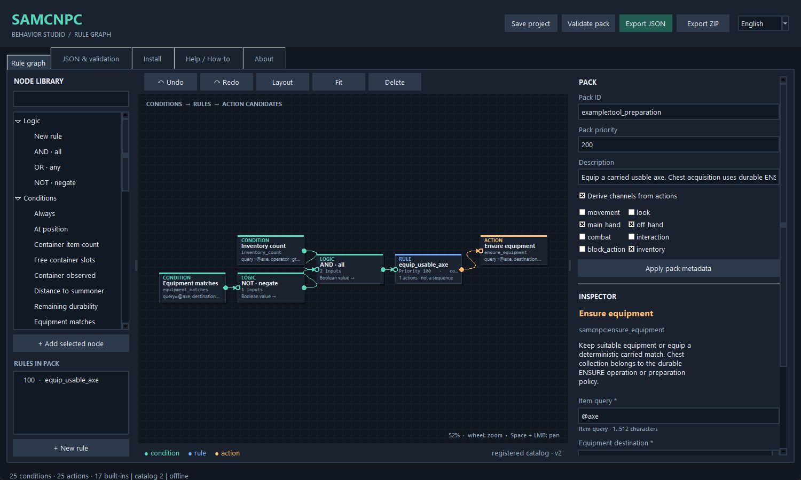
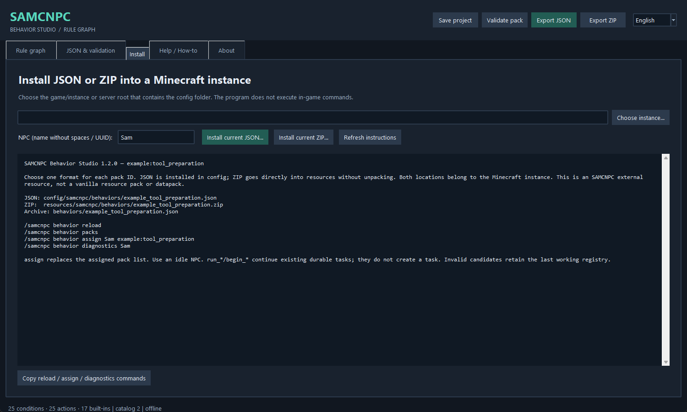

# SAMCNPC Behavior Studio 1.2.0 — Build your own behavior packs

English | [Polski](GUIDE_PL.md) | [Deutsch](GUIDE_DE.md)

[Back to Studio](../README.md)

This GitHub guide replaces the White and Black PDF variants. GitHub applies your selected light or dark theme; the instructions and examples are shared. No programming is required.

<a id="contents"></a>

## Contents

1. [Start with a safe test](#chapter-1)
2. [Read the editor](#chapter-2)
3. [Conditions, rules and actions](#chapter-3)
4. [Exercise: follow, then add caution](#chapter-4)
5. [Priorities, channels and retaliation](#chapter-5)
6. [A large graph: Guardian Escort](#chapter-6)
7. [Exact items and explicit categories](#chapter-7)
8. [Inventory and equipment facts](#chapter-8)
9. [Equip a suitable carried item](#chapter-9)
10. [Container observations: unknown is not empty](#chapter-10)
11. [Transient rules and durable tasks](#chapter-11)
12. [Tutorial: a tool from an allowed chest](#chapter-12)
13. [Continue wood work after preparation](#chapter-13)
14. [Space recovery, reserves and worn tools](#chapter-14)
15. [Position, task and failure conditions](#chapter-15)
16. [Save, preview and export ZIP](#chapter-16)
17. [Install into the Minecraft instance](#chapter-17)
18. [Reload and test what really happened](#chapter-18)
19. [Refresh the catalog and troubleshoot](#chapter-19)
20. [In-game troubleshooting and reference](#chapter-20)
21. [Advanced example: Guardian / Forester](#chapter-21)

<a id="chapter-1"></a>

## 1. Start with a safe test

Studio 1.2.0 is an offline editor for SAMCNPC Behavior. It needs Python 3.10+ with Tkinter; the editor itself needs no pip packages. Start START\_WINDOWS.bat, or run python studio.py from its folder.

English is the default. Choose Polski, English or Deutsch at the top right or in the Language menu. Switching translates existing controls and preserves your graph, unsaved fields, JSON draft, selection, undo history and view.

Use a copied Minecraft world with matching Core and Behavior for Forge 1.20.1. LLM is optional. Choose an NPC you control, called Sam in the examples. Replace Sam with its actual name or UUID if names are ambiguous.

Keep your own .samgraph projects. This update does not require a project migration. Do not overwrite your work with bundled examples.

If the editor will not start, run py -3 -m tkinter and then py -3 studio.py in a terminal. Keep any error output and the diagnostic log for a bug report.

[Contents](#contents)

<a id="chapter-2"></a>

## 2. Read the editor



The left library lists registered conditions, actions and logic nodes. Search by name or stable component ID; double-click to add a node. The rule list helps navigate larger graphs.

The center is the dark canvas. Drag nodes with the left mouse button; pan with the middle button or Space+drag; zoom with the wheel; press F to fit. Delete removes the selected node or wire. Ctrl+Z / Ctrl+Y undo and redo.

The right panel contains pack metadata and the selected node's Inspector. Each has its own Apply button. Scroll the panel to reach all parameters. Required fields carry an asterisk; bounds, choices and defaults come from the registered catalog.

Top buttons save the project, validate, export JSON or export ZIP. Other tabs contain JSON and validation, installation, help and About. Node position only changes the drawing, never action priority.

[Contents](#contents)

<a id="chapter-3"></a>

## 3. Conditions, rules and actions

A typical graph is Condition -&gt; AND/OR/NOT -&gt; Rule -&gt; Action. Drag an output port to an input port. A rule accepts one condition tree and 1..16 candidate actions. AND/OR combine 1..16 conditions; NOT has exactly one input.

AND requires every input, OR at least one, NOT reverses its input. These nodes describe a test. Wires do not carry execution from one action into the next. An action failure does not automatically run an else branch in the same tick.

Example: has\_summoner AND distance\_to\_summoner gt 8 makes a follow rule eligible. The action is considered again on later evaluations; it is not a one-time instruction sent along a wire.

Give every rule a distinct ID. Connect or remove orphan nodes before export. A .samgraph can preserve an unfinished layout, but runtime export must pass validation.

Inspect the JSON preview after applying changes. It shows the actual behavior document, without editor-only coordinates.

[Contents](#contents)

<a id="chapter-4"></a>

## 4. Exercise: follow, then add caution

Open the Follow example. Change the pack ID to tutorial:follow so it cannot collide with samcnpc:follow\_summoner. Keep the has\_summoner condition and move\_to\_summoner action connected through the rule.

In the action Inspector use startDistance 8 and stopDistance 2; start must exceed stop. Keep cooldown 0 for continuous movement. Let Studio select required channels automatically. Apply both the node and pack edits, validate and save tutorial\_follow.samgraph.

Export and install one format, reload in Minecraft and assign tutorial:follow. On open ground move away, approach again and observe stopping. Check diagnostics if another movement rule wins.

For cautious following, open the supplied cautious example. Use AND to combine the summoner condition with health\_fraction, operator gt, value 0.35. Apply and inspect the JSON before export.

Test immediately above and below 35% health. Stopping a follow rule is not a healing algorithm or a safe escape route. State the behavior you expect, then compare it with actual play.

[Contents](#contents)

<a id="chapter-5"></a>

## 5. Priorities, channels and retaliation

Higher rule priority wins first, then higher pack priority. Ties use pack ID, rule ID and action order. Graph position never decides. An action receives all of its required channels or none.

movement and look control travel and gaze. main\_hand, off\_hand and combat coordinate equipment and fighting. interaction, inventory and block\_action cover other physical work. Selecting a channel is not permission to invent a new action.

An unconditional stop\_movement at priority 500 can defeat following at 100. ensure\_equipment claims inventory plus both hand channels; it can conflict with combat or a durable task. Prefer a condition that stops matching once equipment is suitable. Do not repeatedly equip while another controller needs the hands.

Cooldown delays later evaluation after an accepted/successful action; it is not action duration or a wait node. Continuous movement and run\_\* task controllers normally keep 0.

Open the retaliation example to study target acquisition and attack as separate rules. Test with one controlled attacker in a copied world. Retaliation is not proof that every threat to the summoner is detected.

[Contents](#contents)

<a id="chapter-6"></a>

## 6. A large graph: Guardian Escort


Open [`examples/complex_guardian_escort.samgraph`](examples/complex_guardian_escort.samgraph) from this guide bundle. The existing project has 9 rules, 80 nodes and 71 wires. It remains compatible with Studio 1.2.0. Select a rule in the left list and zoom into that section.

The groups are disengage/return (1000, 950, 940), retaliation (850, 800), escort (500, 350, 300) and safe idle without player/target (100). Read these groups before individual wires.

The panic branch combines low health and a recent hit. clear\_attack\_target and stop\_movement may run together on separate channels. Other rules observe the changed target on a later evaluation.

Two useful review exercises: the follow rule stops matching near distance 8 although its action stopDistance is 3.5; do not promise a final 3.5-block gap. The retaliation gate only checks health above 22%, so a recent hit at 22–35% may cause target acquire/clear cycling. Try guarding combat with NOT of the complete panic condition.

This is an authoring example, not verified production protection AI. Local validation cannot prove sensible gameplay. Test health thresholds, recent-hit expiry and distance transitions.

[Contents](#contents)

<a id="chapter-7"></a>

## 7. Exact items and explicit categories

Use one query field for item needs. minecraft:coal selects coal only. Charcoal in the inventory does not satisfy it, even though both can be fuel. Broader meaning must be explicit: minecraft:coal|minecraft:charcoal accepts either.

@axe selects tools reported as axes by Core; @pickaxe, @shovel and @hoe work similarly. Other supported roles are @food, @placeable\_block, @tool, @shield, @armor, @melee\_weapon, @ranged\_weapon and @ammunition.

A role comes from authoritative item knowledge, never a guess from its name or an LLM. A query contains one item/role or 2..8 distinct alternatives separated by |, with no nesting. Maximum length is 512 characters; one exact ID is at most 128.

There are no arbitrary tag queries in this release. Do not enter a URL, command, class or script. The Inspector validates the supported syntax before export.

Choose exact items when identity is part of the mission. Choose a role only when any physically suitable member is acceptable. Categories do not grant permission to use a new source chest.

[Contents](#contents)

<a id="chapter-8"></a>

## 8. Inventory and equipment facts

All component IDs on this page begin with samcnpc:. inventory\_count takes query, operator and count, plus optional minimumDurability. Example: query minecraft:coal, operator gte, count 2. Charcoal gives a count of zero for that query.

gt / gte mean greater than / at least; lt / lte mean less than / at most; eq means equal. inventory\_free\_slots compares empty carried slots, from 0 to 36. A partially filled stack is not an empty slot and does not guarantee compatible space.

Inventory count includes carried items and separate equipment once. MAIN\_HAND is the selected hotbar slot and is not counted again. equipment\_matches checks a single destination: MAIN\_HAND, OFF\_HAND, HEAD, CHEST, LEGS or FEET.

minimumDurability ranges from 0 to 1. Use 0.2 for at least 20% remaining life. Fully broken tools are unusable even with minimum 0. Nondamageable items have fraction 1. durability\_fraction compares remaining life of one equipped item; empty equipment does not match.

These observations come from the authoritative NPC. A number shown by a language model is not inventory evidence.

[Contents](#contents)

<a id="chapter-9"></a>

## 9. Equip a suitable carried item


Open the new Tool preparation example. inventory\_count checks @axe with minimumDurability 0.2 and count gte 1. NOT equipment\_matches checks that MAIN\_HAND does not already hold a suitable axe. AND combines these tests before the rule proposes ensure\_equipment.

The action takes query @axe, destination MAIN\_HAND and minimumDurability 0.2. It keeps a valid current item; otherwise it chooses a compatible carried candidate deterministically. Equipment quality, durability and stable slot ties avoid random switching.

This is not a universal promise to choose the fastest tool for every block. Core still evaluates physical mining suitability. An armor destination accepts compatible armor; a helmet cannot be equipped as boots.

Save the example under your own ID. Validate, export one format and test with a worn axe plus a usable backup in inventory. Then test with no axe: the action must not create one or secretly scan chests.

The example is deliberately a transient equipment rule. For an allowed source chest and continuation of longer work, use the durable preparation described next. Avoid competing hand rules during a task.

[Contents](#contents)

<a id="chapter-10"></a>

## 10. Container observations: unknown is not empty

container\_observed, container\_count and container\_free\_slots address SOURCE or DESTINATION with index 0..7. The endpoint must already belong to the current task or its authorized logistics policy. A rule cannot supply arbitrary chest coordinates.

The chest must pass Core's access check: loaded, nearby, visible, unlocked and supported. No global scan, x-ray view or chunk loading is performed just to inspect storage. Stock is checked on demand; cached rule observations are at most 20 ticks old. Transfers always recheck.

container\_count adds query, operator and count. container\_free\_slots counts empty slots, not guaranteed room for any NBT-bearing stack. A suitable slot still needs physical transfer validation.

An unobserved chest has no numeric fact. Even count eq 0 is false while unknown. Pair container\_observed with your numeric test to make the intended meaning obvious. Never interpret NOT container\_count gte 1 as proof of an empty chest.

A durable task can walk to a declared source and inspect it there. A locked or unavailable source reports an explicit failure instead of pretending its contents are zero.

[Contents](#contents)

<a id="chapter-11"></a>

## 11. Transient rules and durable tasks

A behavior pack evaluates present conditions and proposes actions. A durable task stores a goal, remaining budget, progress, physical receipts and recovery state. The run\_\* actions advance existing tasks; merely placing such a node does not create one.

Core supplies the body and physical mechanics. Behavior decides when to prepare, move, collect, equip, unload and resume. Optional LLM interprets high-level intent; it cannot control ticks or directly mutate the world.

The existing inventory task now supports ENSURE. It observes current inventory, selects a finite next step, approaches only declared sources, transfers real items, equips if requested, reobserves and returns to its anchor. Already sufficient inventory avoids unnecessary collection.

A logistics preparation policy can interrupt a parent task using the same bounded machinery. It preserves the primary goal, reserves required resources and resumes work after return. No second task framework or hidden model request is involved.

Custom JSON/ZIP selects registered components and bounded parameters. It cannot create a new Kotlin algorithm, a crafting system or arbitrary Minecraft commands. New task algorithms require a mod implementation and its validation.

[Contents](#contents)

<a id="chapter-12"></a>

## 12. Tutorial: a tool from an allowed chest

Goal: Sam has no usable axe, an allowed chest contains several tools, and Sam must take an axe, equip it and then work. First practice preparation alone in a copied world on open, level ground.

Place an unlocked chest within 16 blocks of Sam. Put an iron pickaxe, an iron axe and a stone shovel inside. Keep Sam's inventory empty. Replace 10,64,10 below with the chest's absolute block coordinates; MAIN\_HAND is literal and case-sensitive.

```text
/samcnpc behavior task assign Sam ensure "@axe" 1 "10,64,10" MAIN_HAND 0.2 0
```

The arguments mean query, required count, allowed source, equipment destination, minimum remaining durability and source reserve. The final 0 permits taking the last matching axe. A reserve of 1 would keep one matching item in the source.

Watch Sam approach, take the axe, equip it and return. Inspect task status and inventory history. The pickaxe and shovel must remain. This uses no LLM and grants access only to the declared source.

```text
/samcnpc behavior task status Sam
/samcnpc behavior task inventory_history Sam 1
```

Try a locked source and then a source with no axe. Expect explicit failure, no invented item and no remote/global chest search.

[Contents](#contents)

<a id="chapter-13"></a>

## 13. Continue wood work after preparation

Now create a normal lumberjack task, pause it promptly, add its preparation policy, then resume. Use the command completion to select a small safe work box and a separate output chest. This example assumes an oak work area from 20,64,20 to 24,68,24 and an output chest at 18,64,20; replace every coordinate for your world.

```text
/samcnpc behavior task assign Sam lumberjack 20 64 20 24 68 24 18 64 20 samcnpc:oak 3
/samcnpc behavior task pause Sam
/samcnpc behavior task logistics Sam prepare "@axe" 1 "10,64,10" MAIN_HAND 0.2 0
/samcnpc behavior task resume Sam
```

Keep source, work and return points inside the bounded travel area. The policy chooses a carried backup first, otherwise the permitted source. Sam returns, resumes chopping and delivers the actual logs. Keep the task's original controller pack assigned; assigning an unrelated example pack over it may cancel the task.

The native acceptance demo proves this sequence including physical chopping and delivery. It also saves between collection and equip, then resumes without collecting twice. Your world can still fail because of terrain, blocked access or missing resources; read status rather than assuming success.

Studio's Tool preparation example illustrates inventory/equipment conditions. The chest policy above is an existing task operation; it is not created by a wire in that graph.

[Contents](#contents)

<a id="chapter-14"></a>

## 14. Space recovery, reserves and worn tools

Full inventory need not require a model. Authorize a destination and an explicit list of excess items that may be unloaded. For an existing task, this example preserves 64 cobblestone and asks for two free slots:

```text
/samcnpc behavior task logistics Sam free_slots "12,64,10" "minecraft:cobblestone=64" 2
```

Only listed excess can move. Selected/equipped items, parent-task resources and preparation-query items remain protected. Partial stacks do not count as free slots. If unloading allowed excess cannot create enough room, the result is INVENTORY\_FULL; nothing is dumped blindly.

The space goal is maintained while the policy is active. Later pickups can trigger another bounded unload. Reserve values are quantities to keep, not quantities to deposit. Multiple entries use semicolons inside the quoted string.

For tool wear, use preparation with minimumDurability 0.2. A valid current tool is retained, then a usable carried replacement is considered, then a declared source. There is no automatic crafting or unlimited search.

Check inventory\_history after each interruption. Reports identify actual supplied/unloaded items and return outcome. Repeated failure is bounded by task budgets and interruption limits; it is not a reason to invent success.

[Contents](#contents)

<a id="chapter-15"></a>

## 15. Position, task and failure conditions

at\_position compares the NPC's feet with x, y, z and a radius from 0 to 64. It is three-dimensional distance; use coordinates in the current world context. It is not pathfinding success or a promise of visibility.

task\_status tests the current durable task status. task\_attempts\_remaining compares the current frame's remaining attempts. last\_task\_failure checks a recorded failure reason. With no task or no recorded failure, these facts do not match.

Use these conditions to make a visible response or suppress an unsuitable rule. Do not assume they create an event queue, unlimited history or an automatic retry algorithm. The durable runtime already owns bounded recovery.

For item preparation, inspect inventory\_history as well as task status. MISSING\_TOOL, MISSING\_EQUIPMENT and MISSING\_RESOURCE describe unsatisfied preparation; SOURCE\_UNAVAILABLE identifies unknown/unavailable stock. A parent task can report its own broader terminal reason.

Test both success and failure. A condition matching a status is only a fact about that task; it is not independent proof that a model's entire mission was fulfilled.

[Contents](#contents)

<a id="chapter-16"></a>

## 16. Save, preview and export ZIP

Save .samgraph to preserve nodes, wires and layout. It remains an editor project, not a file that Minecraft loads. JSON preview/export contains only the behavior document. Apply inspector, metadata and JSON drafts deliberately before exporting.

Choose Export ZIP to create a directly loadable external Behavior archive. Studio writes behaviors/&lt;safe-name&gt;.json plus installation notes. It does not embed executable code or your .samgraph project. Keep the project separately for future editing.

One archive may contain several JSON packs under behaviors/, including orderly subfolders. Root-level JSON and unrelated documentation are not behavior documents. IDs must be unique across built-ins, loose JSON and every ZIP.

Studio validates before export/install and asks before replacement. Installation makes a backup when replacement is explicitly accepted. Do not keep both JSON and ZIP versions of the same pack ID in active folders.

Archives have finite limits: 16 ZIP files, 128 entries each, 128 KiB per expanded entry, 2 MiB expanded per archive and 64 external behavior documents overall. Strange paths, links, oversized data and invalid ZIPs are rejected. Ordinary Studio exports use a compatible safe structure.

[Contents](#contents)

<a id="chapter-17"></a>

## 17. Install into the Minecraft instance



Open Installation and choose the Minecraft instance root: the folder containing that instance's config and mods folders, not a world save. Studio constructs the destination itself.

```text
JSON: <instance>/config/samcnpc/behaviors/<file>.json
ZIP: <instance>/resources/samcnpc/behaviors/<file>.zip
```

Use Install current JSON or Install current ZIP. ZIP goes in directly without unpacking. This is an SAMCNPC external resource location, not vanilla resourcepacks or datapacks. An archive can contain behaviors/helpers/tool.json; loose config JSON belongs directly in its folder.

Select one format per pack ID. During replacement, review the file and backup confirmation. An unrelated invalid existing source can reject installation/reload; inspect it rather than overwriting user files blindly.

On a dedicated server, the authoritative files belong to the server instance. Installing only on your client does not install a server behavior. Copy the finished file to the server using your normal authorized method; Studio does not log into servers.

The screenshot shows the actual updated installation tab. The selected instance determines the destination; the program does not modify a mod JAR.

[Contents](#contents)

<a id="chapter-18"></a>

## 18. Reload and test what really happened

Save the complete file before requesting reload. As an operator, run the following; assign your own pack ID rather than a reference's built-in ID:

```text
/samcnpc behavior reload
/samcnpc behavior packs
/samcnpc behavior assign Sam example:tool_preparation
/samcnpc behavior diagnostics Sam
```

Built-ins, loose JSON and ZIP documents compile as one candidate. Any invalid document, unknown component, duplicate ID or source error rejects the entire candidate. The last accepted registry keeps running. A rejected reload does not mean that your edited rules became active.

Diagnostics identify ZIP members, for example external-zip:tools.zip!/behaviors/axe.json. Fix that source, save and retry. Renaming a file does not fix duplicate IDs inside documents.

Use a small matrix: suitable tool already equipped; backup carried; tool only in allowed chest; missing tool; full inventory; unknown chest; exact coal with charcoal only. Check physical quantities and return position, then repeat relevant cases after a restart.

The current native tests cover these important physical cases and a Studio-produced ZIP. Screenshots and a model's summary alone are not gameplay evidence.

[Contents](#contents)

<a id="chapter-19"></a>

## 19. Refresh the catalog and troubleshoot

The bundled registered schema is generated by BehaviorSchemaApi / BehaviorCatalogApi. Studio builds node definitions and fields from it. It currently contains 25 conditions, 25 actions and 17 built-in pack IDs; document schemaVersion remains 1.

File -&gt; Load registered catalog accepts behavior-pack-registered.schema.json from the matching Behavior contracts folder. A malformed or unsupported catalog is rejected without replacing the active catalog. Refresh is local to that editor session. Revalidate the graph against the chosen version before export; loading a catalog does not install a newer mod.

For a bundled update, maintainers run make\_catalog.py with the repository or schema path, then make\_schema.py. Do not edit generated fields by hand to invent capabilities. Unknown future text formats are rejected rather than executed as code.

If a value seems ignored, use its Apply button and inspect JSON. If JSON is marked unapplied, choose JSON -&gt; graph or deliberately restore Graph -&gt; JSON. If nodes disappear, press F and check the selected tab. For rejected numbers, use a decimal point and the displayed bounds.

After a GUI error, keep %USERPROFILE%/samcnpc-studio-error.log plus version, language, OS and a small reproducing project. Current Windows tests exercise all registered components and repeated language switches.

[Contents](#contents)

<a id="chapter-20"></a>

## 20. In-game troubleshooting and reference

Pack missing from the list: check the actual instance, folder, behaviors/ archive prefix and full reload result. Old ZIP bundles containing config/... must be re-exported in Studio 1.2.0. A file name is not the pack ID.

Pack listed but inactive: inspect assignments and conditions. A higher-priority action may occupy a required channel. A run\_\* node needs an existing task; a task needs its own controller pack. Use a copied world with one NPC and one custom pack first.

Preparation failed: check allowed source coordinates, distance, visibility, lock, matching query, source reserve and remaining durability. Unknown stock is not empty. Check task inventory\_history for the explicit local result. Full inventory requires an authorized unload list and reachable destination.

The tutorial projects are included in [examples/](examples/). Keep the editable `.samgraph` file separately from the JSON or ZIP installed in Minecraft.

See [local preparation](../docs/LOCAL_AUTONOMY.md), [ZIP format and limits](../docs/EXTERNAL_BEHAVIOR_ZIPS.md), the [registered schema](../vendor/behavior-pack-registered.schema.json) and [dated validation](../docs/TEST_REPORT.md).

Based on the Studio 1.2.0 manual of 27 September 2026; adapted for GitHub on 28 September 2026. The original 20 chapters and command examples are retained, with repository links and one new advanced-example chapter. Native runtime evidence is separate from editor validation.

[Contents](#contents)

<a id="chapter-21"></a>

## 21. Advanced example: Guardian / Forester

Open [guardian_forester.samgraph](../examples/advanced/guardian_forester/guardian_forester.samgraph) through **File → Open**. This newer example has **33 rules, 506 nodes and 473 connections**. It complements the older Guardian Escort exercise; the two projects are different.

Review the rule groups for safety, retaliation, equipment, durable task preparation/recovery and escort. Validate in Studio, switch the interface language and inspect the JSON. Node layout helps navigation; priorities and channels still determine execution.

The example includes [JSON](../examples/advanced/guardian_forester/guardian_forester.json), [ZIP](../examples/advanced/guardian_forester/guardian_forester.zip), a [Polish walkthrough](../examples/advanced/guardian_forester/README_PL.md) and [dated physical test evidence](../examples/advanced/guardian_forester/VALIDATION.md). Assigning the pack alone does not create a lumberjack mission or authorize a chest. Keep the existing task's controller assigned and configure the explicit preparation/unload policy.

A native regression tested full inventory together with a missing axe: permitted excess was unloaded, an axe was obtained from the authorized chest, and three logs were chopped and delivered. This exposed and fixed a generic Behavior preparation-cooldown issue. Use the matching Behavior build; these results do not apply automatically to older JARs.


[Contents](#contents)
