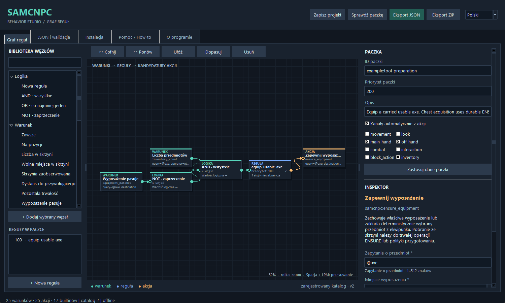
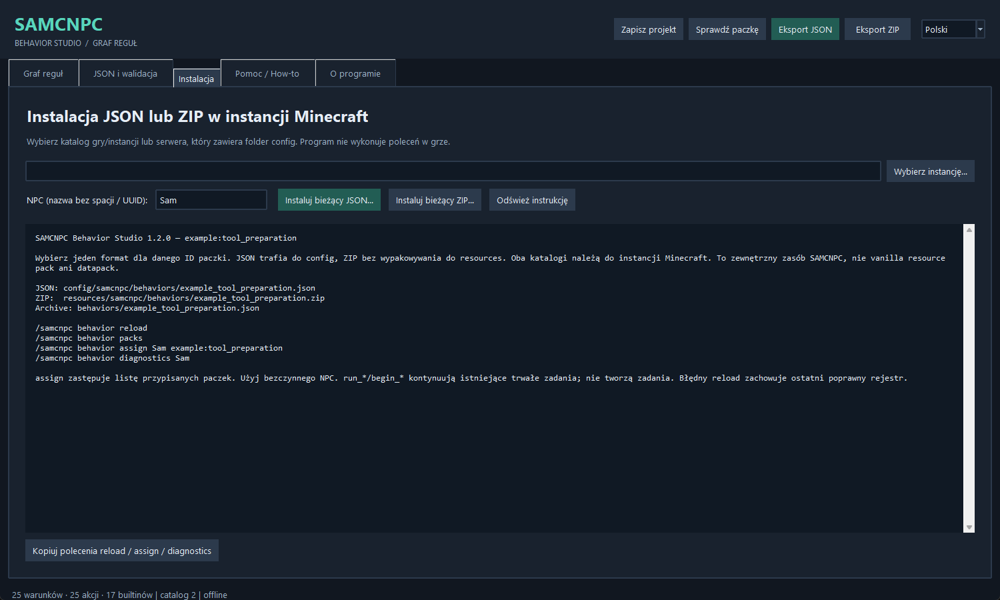
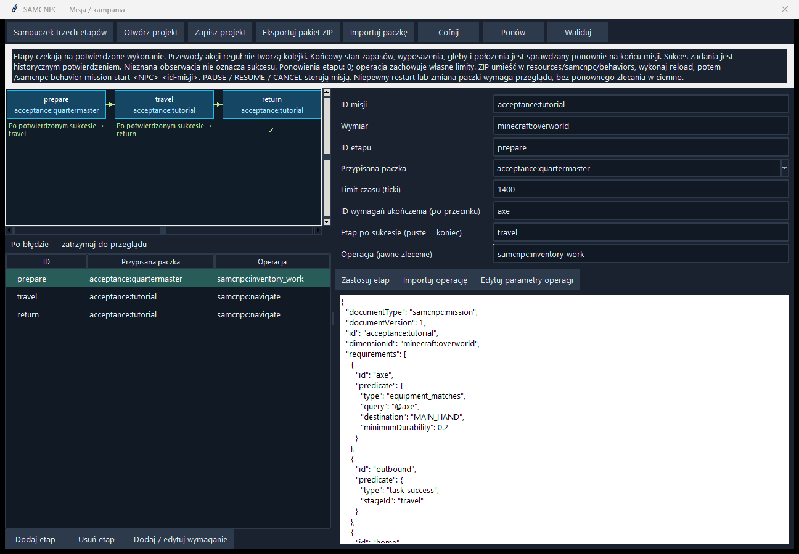

# SAMCNPC Behavior Studio 1.3.0 — Twórz własne paczki zachowań

[English](GUIDE_EN.md) | Polski | [Deutsch](GUIDE_DE.md)

[Powrót do Studio](../README_PL.md)

Ten poradnik GitHub zastępuje warianty PDF White i Black. GitHub stosuje wybrany jasny lub ciemny motyw; instrukcje i przykłady są wspólne. Nie trzeba programować.

<a id="contents"></a>

## Spis treści

1. [Zacznij od bezpiecznej próby](#chapter-1)
2. [Poznaj edytor](#chapter-2)
3. [Warunki, reguły i akcje](#chapter-3)
4. [Ćwiczenie: podążanie i ostrożność](#chapter-4)
5. [Priorytety, kanały i odwet](#chapter-5)
6. [Duży graf: Guardian Escort](#chapter-6)
7. [Dokładny przedmiot i jawna kategoria](#chapter-7)
8. [Fakty o ekwipunku i wyposażeniu](#chapter-8)
9. [Wyposaż odpowiedni noszony przedmiot](#chapter-9)
10. [Obserwacja skrzyni: nieznana nie znaczy pusta](#chapter-10)
11. [Chwilowe reguły i trwałe zadania](#chapter-11)
12. [Samouczek: narzędzie z dozwolonej skrzyni](#chapter-12)
13. [Kontynuuj ścinanie po przygotowaniu](#chapter-13)
14. [Miejsce, rezerwy i zużyte narzędzia](#chapter-14)
15. [Warunki pozycji, zadania i błędu](#chapter-15)
16. [Zapisz, podejrzyj i wyeksportuj ZIP](#chapter-16)
17. [Instalacja w instancji Minecraft](#chapter-17)
18. [Przeładuj i sprawdź rzeczywisty wynik](#chapter-18)
19. [Odśwież katalog i rozwiąż problem](#chapter-19)
20. [Problemy w grze i materiały](#chapter-20)
21. [Zaawansowany przykład: Guardian / Forester](#chapter-21)

22. [Widok misji: prawdziwe połączenia paczek](#chapter-22)
23. [Samouczek trzech etapów i pełna misja](#chapter-23)
24. [Ukończenie, restart i ręczne sterowanie](#chapter-24)

<a id="chapter-1"></a>

## 1. Zacznij od bezpiecznej próby

Studio 1.3.0 to edytor offline dla SAMCNPC Behavior. Wymaga Pythona 3.10+ z Tkinterem; sam edytor nie wymaga pakietów pip. Uruchom START\_WINDOWS.bat albo python studio.py z katalogu programu.

Domyślny język to angielski. W prawym górnym rogu lub menu Language wybierz Polski, English albo Deutsch. Zmiana tłumaczy istniejące kontrolki i zachowuje graf, niezastosowane pola, szkic JSON, zaznaczenie, historię cofania oraz widok.

Testuj na kopii świata Minecraft z pasującymi Core i Behavior dla Forge 1.20.1. LLM jest opcjonalny. W przykładach używamy kontrolowanego przez Ciebie NPC o imieniu Sam. Podstaw właściwe imię lub UUID, jeśli imiona się powtarzają.

Zachowaj własne projekty .samgraph. Aktualizacja nie wymaga migracji projektu. Nie nadpisuj swojej pracy przykładami z paczki.

Gdy okno się nie otwiera, uruchom w terminalu py -3 -m tkinter, a potem py -3 studio.py. Zachowaj komunikaty i log diagnostyczny do zgłoszenia błędu.

[Spis treści](#contents)

<a id="chapter-2"></a>

## 2. Poznaj edytor



Biblioteka po lewej zawiera zarejestrowane warunki, akcje i węzły logiki. Szukaj nazwy lub stałego ID komponentu; dwuklik dodaje węzeł. Lista reguł ułatwia nawigację w dużym grafie.

Pośrodku znajduje się ciemne płótno. Przesuwaj węzły lewym przyciskiem; widok środkowym przyciskiem albo Spacja+przeciąganie. Rolka zmienia zoom, F dopasowuje graf. Delete usuwa zaznaczony węzeł lub przewód. Ctrl+Z / Ctrl+Y cofa i ponawia.

Panel po prawej zawiera dane paczki i Inspektor zaznaczonego węzła. Każda część ma własny przycisk Zastosuj. Przewiń panel, aby dotrzeć do wszystkich parametrów. Pola wymagane mają gwiazdkę; granice, wybory i wartości domyślne pochodzą z katalogu.

Przyciski u góry zapisują projekt, sprawdzają go i eksportują JSON lub ZIP. Pozostałe zakładki zawierają JSON i walidację, instalację, pomoc oraz informacje o programie. Pozycja węzła wpływa tylko na rysunek, nie na priorytet akcji.

[Spis treści](#contents)

<a id="chapter-3"></a>

## 3. Warunki, reguły i akcje

Typowy graf: Warunek -&gt; AND/OR/NOT -&gt; Reguła -&gt; Akcja. Przeciągnij port wyjściowy do wejściowego. Reguła przyjmuje jedno drzewo warunku i 1..16 kandydatów na akcje. AND/OR łączy 1..16 warunków; NOT ma dokładnie jedno wejście.

AND wymaga wszystkich wejść, OR przynajmniej jednego, NOT odwraca wynik. To opis testu. Przewody nie przenoszą wykonania między akcjami. Niepowodzenie akcji nie uruchamia automatycznie gałęzi else w tym samym ticku.

Przykład: has\_summoner AND distance\_to\_summoner gt 8 pozwala rozpatrzyć regułę podążania. Akcja jest rozważana ponownie podczas kolejnych ocen; nie jest jednorazowym poleceniem przesłanym przewodem.

Każda reguła potrzebuje własnego ID. Połącz lub usuń osierocone węzły przed eksportem. .samgraph zachowa niedokończony układ, ale eksport wykonawczy musi przejść walidację.

Po zastosowaniu zmian sprawdź podgląd JSON. Pokazuje rzeczywistą paczkę, bez współrzędnych należących tylko do edytora.

[Spis treści](#contents)

<a id="chapter-4"></a>

## 4. Ćwiczenie: podążanie i ostrożność

Otwórz przykład Podążanie. Zmień ID paczki na tutorial:follow, aby nie kolidowało z samcnpc:follow\_summoner. Pozostaw has\_summoner i move\_to\_summoner połączone przez regułę.

W Inspektorze akcji ustaw startDistance 8 i stopDistance 2; początek musi przewyższać zatrzymanie. Dla ciągłego ruchu pozostaw cooldown 0. Pozwól Studio automatycznie dobrać kanały. Zastosuj zmiany węzła i paczki, sprawdź i zapisz tutorial\_follow.samgraph.

Wyeksportuj i zainstaluj jeden format, przeładuj paczki w grze i przypisz tutorial:follow. Na otwartym terenie oddal się, wróć i obserwuj zatrzymanie. Jeśli wygrywa inna reguła ruchu, sprawdź diagnostykę.

Dla ostrożnego podążania otwórz dostarczony przykład. AND łączy warunek obecności przywołującego z health\_fraction, operatorem gt i wartością 0.35. Zastosuj i obejrzyj JSON przed eksportem.

Testuj tuż powyżej i poniżej 35% zdrowia. Wyłączenie podążania nie jest leczeniem ani gwarancją bezpiecznej ucieczki. Najpierw określ oczekiwane zachowanie, a potem porównaj je z grą.

[Spis treści](#contents)

<a id="chapter-5"></a>

## 5. Priorytety, kanały i odwet

Najpierw wygrywa wyższy priorytet reguły, potem paczki. Remisy rozstrzygają ID paczki, ID reguły i kolejność akcji. Położenie grafu nie decyduje. Akcja otrzymuje wszystkie wymagane kanały albo żaden.

movement i look sterują ruchem i spojrzeniem. main\_hand, off\_hand i combat uzgadniają wyposażenie oraz walkę. interaction, inventory i block\_action obejmują pozostałe czynności. Zaznaczenie kanału nie pozwala wymyślić nowej akcji.

Bezwarunkowe stop\_movement z priorytetem 500 może pokonać podążanie z 100. ensure\_equipment zajmuje inventory i obie ręce, więc może kolidować z walką albo taskiem. Stosuj warunek wygasający po uzyskaniu właściwego wyposażenia. Nie wyposażaj ponownie, gdy inny kontroler potrzebuje rąk.

Cooldown opóźnia następną ocenę po przyjętej lub udanej akcji; nie oznacza czasu trwania ani węzła oczekiwania. Ciągły ruch i kontrolery run\_\* zwykle pozostawiają 0.

Otwórz przykład odwetu, aby poznać oddzielne reguły wyboru celu i ataku. Testuj z jednym kontrolowanym napastnikiem na kopii świata. Odwet nie dowodzi wykrywania każdego zagrożenia dla przywołującego.

[Spis treści](#contents)

<a id="chapter-6"></a>

## 6. Duży graf: Guardian Escort


Otwórz [`examples/complex_guardian_escort.samgraph`](examples/complex_guardian_escort.samgraph) z pakietu instrukcji. Istniejący projekt ma 9 reguł, 80 węzłów i 71 przewodów. Pozostaje zgodny ze Studio 1.3.0. Wybierz regułę na liście po lewej i przybliż jej fragment.

Grupy: przerwanie walki/powrót (1000, 950, 940), odwet (850, 800), eskorta (500, 350, 300) i bezpieczna bezczynność bez gracza/celu (100). Najpierw czytaj grupy, później przewody.

Gałąź paniki łączy niskie zdrowie z niedawnym trafieniem. clear\_attack\_target i stop\_movement mogą działać razem na oddzielnych kanałach. Inne reguły zobaczą zmianę celu przy późniejszej ocenie.

Dwa ćwiczenia przeglądu: reguła podążania wygasa przy dystansie około 8, choć stopDistance akcji to 3.5; nie obiecuj końcowej odległości 3.5. Bramka odwetu sprawdza tylko zdrowie ponad 22%, więc świeże trafienie przy 22–35% może powodować wybieranie i kasowanie celu. Spróbuj dodać NOT całego warunku paniki do walki.

To przykład do nauki, nie dowód skutecznej ochrony. Walidacja lokalna nie dowodzi rozsądnego zachowania. Testuj progi zdrowia, wygaśnięcie niedawnego trafienia i przejścia dystansu.

[Spis treści](#contents)

<a id="chapter-7"></a>

## 7. Dokładny przedmiot i jawna kategoria

Potrzeby opisuje jedno pole zapytania. minecraft:coal wybiera wyłącznie węgiel. Węgiel drzewny w ekwipunku go nie zastępuje, mimo że oba są paliwem. Szerszy sens musi być jawny: minecraft:coal|minecraft:charcoal dopuszcza oba.

@axe wybiera narzędzia rozpoznane przez Core jako siekiery; podobnie działają @pickaxe, @shovel i @hoe. Pozostałe role to @food, @placeable\_block, @tool, @shield, @armor, @melee\_weapon, @ranged\_weapon i @ammunition.

Rola pochodzi z autorytatywnej wiedzy o przedmiocie, nigdy ze zgadywania nazwy ani z LLM. Zapytanie zawiera jeden przedmiot/rolę lub 2..8 różnych alternatyw rozdzielonych |, bez zagnieżdżeń. Limit to 512 znaków; pojedyncze ID ma najwyżej 128.

W tej wersji nie ma dowolnych zapytań po tagach. Nie wpisuj adresu URL, komendy, klasy ani skryptu. Inspektor sprawdza obsługiwaną składnię przed eksportem.

Używaj dokładnych ID, gdy tożsamość przedmiotu jest częścią zadania. Wybieraj rolę tylko wtedy, gdy każdy fizycznie odpowiedni element kategorii jest dopuszczalny. Kategoria nie daje prawa korzystania z nowej skrzyni.

[Spis treści](#contents)

<a id="chapter-8"></a>

## 8. Fakty o ekwipunku i wyposażeniu

ID komponentów na tej stronie zaczynają się od samcnpc:. inventory\_count przyjmuje query, operator i count oraz opcjonalne minimumDurability. Przykład: query minecraft:coal, operator gte, count 2. Węgiel drzewny daje dla tego zapytania zero.

gt / gte oznacza więcej niż / przynajmniej; lt / lte mniej niż / najwyżej; eq równość. inventory\_free\_slots porównuje puste miejsca ekwipunku, od 0 do 36. Niepełny stos nie jest pustym miejscem i nie gwarantuje zgodnego miejsca.

Zliczanie obejmuje noszone przedmioty i oddzielne wyposażenie dokładnie raz. MAIN\_HAND jest wybranym miejscem paska i nie jest dodawane ponownie. equipment\_matches sprawdza jeden cel: MAIN\_HAND, OFF\_HAND, HEAD, CHEST, LEGS albo FEET.

minimumDurability ma zakres 0..1. Użyj 0.2 dla przynajmniej 20% pozostałej trwałości. Całkiem zużyte narzędzie jest bezużyteczne także przy minimum 0. Przedmiot bez zużycia ma ułamek 1. durability\_fraction porównuje trwałość pojedynczego wyposażonego przedmiotu; puste wyposażenie nie pasuje.

Obserwacje pochodzą z autorytatywnego NPC. Liczba podana przez model językowy nie stanowi dowodu zawartości ekwipunku.

[Spis treści](#contents)

<a id="chapter-9"></a>

## 9. Wyposaż odpowiedni noszony przedmiot


Otwórz nowy przykład Przygotowanie narzędzia. inventory\_count sprawdza @axe z minimumDurability 0.2 i count gte 1. NOT equipment\_matches sprawdza, czy MAIN\_HAND nie trzyma już odpowiedniej siekiery. AND łączy testy, a reguła proponuje ensure\_equipment.

Akcja otrzymuje query @axe, destination MAIN\_HAND i minimumDurability 0.2. Zachowuje właściwy aktualny przedmiot; w przeciwnym razie deterministycznie wybiera zgodny przedmiot z ekwipunku. Jakość wyposażenia, trwałość i stałe rozstrzyganie po miejscach zapobiegają losowym zmianom.

To nie obietnica zawsze najszybszego narzędzia dla każdego bloku. Core nadal ocenia fizyczną przydatność do kopania. Miejsce pancerza przyjmuje zgodny pancerz; hełm nie staje się butami.

Zapisz przykład pod własnym ID. Sprawdź, wyeksportuj jeden format i przetestuj ze zużytą siekierą oraz sprawnym zapasem. Potem sprawdź brak siekiery: akcja nie może jej stworzyć ani potajemnie skanować skrzyń.

Przykład jest celowo chwilową regułą wyposażenia. Do dozwolonej skrzyni i kontynuowania dłuższej pracy służy opisane dalej trwałe przygotowanie. Podczas taska unikaj konkurujących reguł rąk.

[Spis treści](#contents)

<a id="chapter-10"></a>

## 10. Obserwacja skrzyni: nieznana nie znaczy pusta

container\_observed, container\_count i container\_free\_slots wskazują SOURCE lub DESTINATION z indeksem 0..7. Punkt musi już należeć do bieżącego taska lub jego uprawnionej polityki logistyki. Reguła nie podaje dowolnych współrzędnych skrzyni.

Skrzynia musi przejść kontrolę Core: być załadowana, bliska, widoczna, niezablokowana i obsługiwana. Samo sprawdzanie nie skanuje świata, nie widzi przez ściany ani nie ładuje chunków. Stan jest odczytywany na żądanie; obserwacja reguły ma najwyżej 20 ticków. Transfer sprawdza go ponownie.

container\_count dodaje query, operator i count. container\_free\_slots liczy puste miejsca, nie gwarantuje miejsca dla każdego stosu z NBT. Fizyczny transfer nadal wymaga walidacji.

Niezaobserwowana skrzynia nie ma faktu liczbowego. Nawet count eq 0 jest wtedy fałszywe. Połącz container\_observed z testem liczbowym, aby jasno wyrazić zamiar. NOT container\_count gte 1 nie jest dowodem pustej skrzyni.

Trwały task może podejść do wskazanego źródła i obejrzeć je na miejscu. Zablokowane lub niedostępne źródło daje jawny błąd zamiast udawania zerowej zawartości.

[Spis treści](#contents)

<a id="chapter-11"></a>

## 11. Chwilowe reguły i trwałe zadania

Paczka ocenia aktualne warunki i proponuje akcje. Trwały task zapisuje cel, pozostały budżet, postęp, potwierdzenia fizycznych działań i stan odzyskiwania. Akcje run\_\* rozwijają istniejące zadania; samo umieszczenie węzła nie tworzy taska.

Core dostarcza ciało i fizyczne mechanizmy. Behavior decyduje, kiedy przygotować się, ruszyć, pobrać, wyposażyć, rozładować i wznowić. Opcjonalny LLM interpretuje zamiar wysokiego poziomu; nie steruje tickami ani bezpośrednio światem.

Istniejący task ekwipunku obsługuje teraz ENSURE. Ogląda ekwipunek, wybiera skończony następny krok, podchodzi tylko do wskazanych źródeł, przenosi prawdziwe przedmioty, opcjonalnie wyposaża, sprawdza ponownie i wraca do punktu wyjścia. Wystarczający stan nie powoduje zbędnego pobierania.

Polityka przygotowania może przerwać nadrzędny task tą samą ograniczoną procedurą. Zachowuje główny cel, chroni potrzebne zasoby i wznawia pracę po powrocie. Nie tworzy drugiego systemu zadań ani ukrytego zapytania do modelu.

Własny JSON/ZIP wybiera zarejestrowane komponenty i parametry. Nie tworzy nowego algorytmu Kotlin, systemu craftingu ani dowolnych komend Minecraft. Nowy algorytm wymaga implementacji i testów moda.

[Spis treści](#contents)

<a id="chapter-12"></a>

## 12. Samouczek: narzędzie z dozwolonej skrzyni

Cel: Sam nie ma sprawnej siekiery, wskazana skrzynia zawiera kilka narzędzi, a NPC ma pobrać siekierę, wyposażyć ją i pracować. Najpierw przećwicz samo przygotowanie na kopii świata, na płaskim otwartym terenie.

Postaw niezablokowaną skrzynię do 16 bloków od Sama. Włóż żelazny kilof, żelazną siekierę i kamienną łopatę. Opróżnij ekwipunek Sama. Zastąp 10,64,10 rzeczywistymi absolutnymi współrzędnymi bloku skrzyni; MAIN\_HAND wpisz dosłownie, wielkimi literami.

```text
/samcnpc behavior task assign Sam ensure "@axe" 1 "10,64,10" MAIN_HAND 0.2 0
```

Argumenty to zapytanie, wymagana liczba, dozwolone źródło, miejsce wyposażenia, minimalna trwałość i rezerwa źródła. Końcowe 0 pozwala zabrać ostatnią pasującą siekierę. Rezerwa 1 pozostawi jeden pasujący przedmiot w źródle.

Obserwuj podejście, pobranie siekiery, wyposażenie i powrót. Sprawdź stan taska i historię ekwipunku. Kilof i łopata mają pozostać. Procedura nie używa LLM i dotyczy wyłącznie wskazanego źródła.

```text
/samcnpc behavior task status Sam
/samcnpc behavior task inventory_history Sam 1
```

Sprawdź zablokowane źródło, a potem brak siekiery. Oczekuj jawnego błędu, bez tworzenia przedmiotu i bez zdalnego przeszukiwania innych skrzyń.

[Spis treści](#contents)

<a id="chapter-13"></a>

## 13. Kontynuuj ścinanie po przygotowaniu

Teraz utwórz zwykły task drwala, szybko go wstrzymaj, dodaj politykę przygotowania i wznów. Podpowiedzi komend pomogą wybrać mały bezpieczny obszar i osobną skrzynię wynikową. Przykład zakłada obszar dębu od 20,64,20 do 24,68,24 i skrzynię wynikową 18,64,20; zastąp wszystkie współrzędne dla swojego świata.

```text
/samcnpc behavior task assign Sam lumberjack 20 64 20 24 68 24 18 64 20 samcnpc:oak 3
/samcnpc behavior task pause Sam
/samcnpc behavior task logistics Sam prepare "@axe" 1 "10,64,10" MAIN_HAND 0.2 0
/samcnpc behavior task resume Sam
```

Źródło, praca i punkt powrotu muszą mieścić się w ograniczonym obszarze dojazdu. Polityka najpierw wybierze noszony zapas, potem dozwolone źródło. Sam wróci, wznowi ścinanie i dostarczy rzeczywiste kłody. Zachowaj oryginalną paczkę kontrolera taska; zastąpienie jej inną paczką może anulować zadanie.

Natywny test akceptacyjny dowodzi tej sekwencji wraz ze ścinaniem i dostawą. Zapisuje też stan między pobraniem a wyposażeniem i wznawia bez podwójnego pobrania. Twój teren, zablokowany dostęp lub brak zasobów nadal mogą spowodować błąd; czytaj stan taska.

Przykład Przygotowanie narzędzia w Studio ilustruje warunki ekwipunku i wyposażenia. Powyższa polityka skrzyni jest istniejącą operacją taska, nie powstaje z przewodu w grafie.

[Spis treści](#contents)

<a id="chapter-14"></a>

## 14. Miejsce, rezerwy i zużyte narzędzia

Pełny ekwipunek nie wymaga modelu. Zezwól na cel rozładunku i jawną listę nadmiaru. Dla istniejącego taska przykład zachowuje 64 brukowce i wymaga dwóch wolnych miejsc:

```text
/samcnpc behavior task logistics Sam free_slots "12,64,10" "minecraft:cobblestone=64" 2
```

Przenosić można tylko nadmiar z listy. Wybrane i wyposażone przedmioty, zasoby nadrzędnego taska oraz przedmioty zapytania przygotowania są chronione. Niepełne stosy nie są pustymi miejscami. Jeśli dozwolony rozładunek nie wystarcza, wynik to INVENTORY\_FULL; nic nie jest bezmyślnie wyrzucane.

Cel wolnego miejsca jest utrzymywany przez aktywną politykę. Późniejsze zbieranie może wywołać następny ograniczony rozładunek. Rezerwa oznacza liczbę do zachowania, nie do odłożenia. Wiele wpisów rozdziel średnikami wewnątrz cudzysłowu.

Dla zużycia narzędzia użyj przygotowania z minimumDurability 0.2. Poprawne bieżące narzędzie zostaje, potem rozważany jest noszony zapas, a następnie wskazane źródło. Nie ma automatycznego craftingu ani nieograniczonego szukania.

Po przerwaniu sprawdź inventory\_history. Raport pokazuje rzeczywiście pobrane/odłożone przedmioty i wynik powrotu. Kolejne próby mają budżety oraz limit przerwań; brak możliwości nie może być przedstawiany jako sukces.

[Spis treści](#contents)

<a id="chapter-15"></a>

## 15. Warunki pozycji, zadania i błędu

at\_position porównuje stopy NPC z x, y, z i promieniem 0..64. To odległość trójwymiarowa; używaj współrzędnych właściwego świata. Nie oznacza powodzenia nawigacji ani gwarancji widoczności.

task\_status bada stan bieżącego trwałego taska. task\_attempts\_remaining porównuje liczbę prób pozostałych w aktualnej ramce. last\_task\_failure sprawdza zapisany powód niepowodzenia. Przy braku taska lub zapisanego błędu fakty nie pasują.

Warunki mogą sterować widoczną reakcją lub wykluczyć nieodpowiednią regułę. Nie tworzą kolejki zdarzeń, nieograniczonej historii ani algorytmu ponawiania. Ograniczone odzyskiwanie należy już do trwałego runtime.

Dla przygotowania czytaj inventory\_history oraz stan taska. MISSING\_TOOL, MISSING\_EQUIPMENT i MISSING\_RESOURCE opisują niespełnione przygotowanie; SOURCE\_UNAVAILABLE oznacza nieznany lub niedostępny stan źródła. Nadrzędny task może zgłosić własny szerszy powód zakończenia.

Testuj sukces i błąd. Pasujący stan jest faktem o konkretnym tasku, a nie niezależnym dowodem spełnienia całej misji opisanej przez model.

[Spis treści](#contents)

<a id="chapter-16"></a>

## 16. Zapisz, podejrzyj i wyeksportuj ZIP

.samgraph zachowuje węzły, przewody i układ. To nadal projekt edytora, nie plik ładowany przez Minecraft. Podgląd i eksport JSON zawierają tylko paczkę zachowania. Świadomie zastosuj szkice Inspektora, danych paczki i JSON przed eksportem.

Eksport ZIP tworzy bezpośrednio ładowane zewnętrzne archiwum Behavior. Studio zapisuje behaviors/&lt;bezpieczna-nazwa&gt;.json oraz instrukcje instalacji. Nie osadza kodu ani projektu .samgraph. Projekt zachowaj osobno do dalszej edycji.

Jedno archiwum może zawierać kilka paczek JSON pod behaviors/, także w uporządkowanych podfolderach. JSON w katalogu głównym i dokumentacja nie są dokumentami zachowania. ID muszą być unikalne między wbudowanymi paczkami, luźnym JSON i wszystkimi ZIP-ami.

Studio sprawdza przed eksportem i instalacją oraz pyta przed zastąpieniem. Przy jawnie zaakceptowanej instalacji zastępczej tworzy kopię. Nie trzymaj aktywnych wersji JSON i ZIP z tym samym ID.

Limity obejmują 16 ZIP-ów, 128 wpisów w każdym, 128 KiB na rozwinięty wpis, 2 MiB na rozwinięte archiwum i 64 zewnętrzne dokumenty łącznie. Dziwne ścieżki, linki, nadmiar danych i uszkodzone ZIP-y są odrzucane. Zwykły eksport Studio ma zgodną strukturę.

[Spis treści](#contents)

<a id="chapter-17"></a>

## 17. Instalacja w instancji Minecraft



Otwórz Instalację i wybierz katalog główny instancji Minecraft: folder zawierający jej config i mods, nie zapis świata. Studio samo buduje ścieżkę docelową.

```text
JSON: <instancja>/config/samcnpc/behaviors/<plik>.json
ZIP: <instancja>/resources/samcnpc/behaviors/<plik>.zip
```

Użyj instalacji bieżącego JSON lub ZIP. ZIP trafia bezpośrednio, bez wypakowywania. To zewnętrzny zasób SAMCNPC, nie vanilla resourcepacks ani datapacks. Archiwum może zawierać behaviors/helpers/tool.json; luźny JSON leży bezpośrednio w folderze config.

Wybierz jeden format dla danego ID. Przy zastępowaniu sprawdź plik i potwierdzenie kopii zapasowej. Inne błędne źródło może zablokować instalację lub reload; sprawdź je zamiast bezmyślnie nadpisywać pliki użytkownika.

Na serwerze dedykowanym właściwe pliki należą do instancji serwera. Instalacja tylko na kliencie nie instaluje zachowania serwera. Przenieś gotowy plik zwykłą uprawnioną metodą; Studio nie loguje się na serwery.

Zrzut pokazuje rzeczywistą nową zakładkę instalacji. Wybrana instancja określa cel; program nie modyfikuje JAR-a moda.

[Spis treści](#contents)

<a id="chapter-18"></a>

## 18. Przeładuj i sprawdź rzeczywisty wynik

Zapisz kompletny plik przed przeładowaniem. Jako operator wykonaj poniższe komendy; przypisz własne ID, a nie wbudowane ID przykładu referencyjnego:

```text
/samcnpc behavior reload
/samcnpc behavior packs
/samcnpc behavior assign Sam example:tool_preparation
/samcnpc behavior diagnostics Sam
```

Paczki wbudowane, luźny JSON i dokumenty ZIP tworzą jednego kandydata. Błędny dokument, nieznany komponent, duplikat ID lub błąd źródła odrzuca całość. Ostatni poprawny rejestr pracuje dalej. Odrzucony reload nie oznacza aktywowania Twoich nowych reguł.

Diagnostyka wskazuje wpis ZIP, np. external-zip:tools.zip!/behaviors/axe.json. Popraw źródło, zapisz i ponów. Zmiana nazwy pliku nie usuwa duplikatu ID w dokumentach.

Przetestuj małą macierz: właściwe narzędzie w ręce; zapas w ekwipunku; narzędzie tylko w dozwolonej skrzyni; brak narzędzia; pełny ekwipunek; nieznana skrzynia; dokładny coal przy samym charcoal. Sprawdź fizyczne ilości i punkt powrotu, potem powtórz istotne przypadki po restarcie.


[Spis treści](#contents)

<a id="chapter-19"></a>

## 19. Odśwież katalog i rozwiąż problem

Dołączony schemat powstaje z BehaviorSchemaApi / BehaviorCatalogApi. Studio buduje z niego definicje węzłów i pola. Obecnie zawiera 25 warunków, 25 akcji i 17 ID wbudowanych paczek; schemaVersion dokumentu pozostaje 1.

Plik -&gt; Wczytaj zarejestrowany katalog przyjmuje behavior-pack-registered.schema.json z folderu contracts zgodnego Behavior. Błędny lub nieobsługiwany katalog nie zastępuje aktywnego. Odświeżenie dotyczy bieżącej sesji edytora. Sprawdź graf dla wybranej wersji przed eksportem; wczytanie katalogu nie instaluje nowszego moda.

Przy aktualizacji pakietu opiekun uruchamia make\_catalog.py ze ścieżką repozytorium lub schematu, potem make\_schema.py. Nie edytuj wygenerowanych pól, aby wymyślać funkcje. Nieznane przyszłe formaty tekstowe są odrzucane, nie wykonywane jako kod.

Jeśli wartość wydaje się ignorowana, użyj jej Zastosuj i obejrzyj JSON. Przy niezastosowanym JSON wybierz JSON -&gt; graf albo świadomie odtwórz Graf -&gt; JSON. Gdy znikną węzły, naciśnij F i sprawdź zakładkę. Dla liczb używaj kropki dziesiętnej oraz pokazanych granic.

Po błędzie GUI zachowaj %USERPROFILE%/samcnpc-studio-error.log, wersję, język, system i mały projekt odtwarzający błąd.

[Spis treści](#contents)

<a id="chapter-20"></a>

## 20. Problemy w grze i materiały

Brak paczki na liście: sprawdź rzeczywistą instancję, folder, prefiks behaviors/ w ZIP i cały wynik reload. Stare ZIP-y z config/... wyeksportuj ponownie w Studio 1.3.0. Nazwa pliku nie jest ID paczki.

Paczka jest na liście, ale nie działa: sprawdź przypisanie i warunki. Wyższa reguła może zajmować wymagany kanał. Węzeł run\_\* wymaga istniejącego taska, a task własnego kontrolera. Zacznij od kopii świata, jednego NPC i jednej własnej paczki.

Błąd przygotowania: sprawdź współrzędne dozwolonego źródła, odległość, widoczność, blokadę, zapytanie, rezerwę źródła i trwałość. Nieznana zawartość nie jest pusta. Czytaj jawny wynik lokalny w inventory\_history. Pełny ekwipunek wymaga dozwolonej listy rozładunku i osiągalnego celu.

Projekty ćwiczeń znajdują się w [examples/](examples/). Zachowaj edytowalny plik `.samgraph` osobno od JSON lub ZIP instalowanego w Minecraft.

Zobacz [lokalne przygotowanie](../docs/LOCAL_AUTONOMY.md), [format i limity ZIP](../docs/EXTERNAL_BEHAVIOR_ZIPS.md), [zarejestrowany schemat](../vendor/behavior-pack-registered.schema.json).


[Spis treści](#contents)

<a id="chapter-21"></a>

## 21. Zaawansowany przykład: Guardian / Forester

Otwórz [guardian_forester.samgraph](../examples/advanced/guardian_forester/guardian_forester.samgraph) przez **Plik → Otwórz**. Nowszy przykład ma **33 reguły, 506 węzłów i 473 połączenia**. Uzupełnia wcześniejsze ćwiczenie Guardian Escort; to dwa różne projekty.

Przejrzyj grupy bezpieczeństwa, odwetu, wyposażenia, przygotowania/odzyskiwania trwałych zadań i eskorty. Sprawdź graf w Studio, zmień język i obejrzyj JSON. Układ węzłów ułatwia nawigację, lecz wykonaniem nadal sterują priorytety i kanały.

Obok znajdują się [JSON](../examples/advanced/guardian_forester/guardian_forester.json), [ZIP](../examples/advanced/guardian_forester/guardian_forester.zip), [polska instrukcja pokazu](../examples/advanced/guardian_forester/README_PL.md). Samo przypisanie paczki nie tworzy misji drwala ani uprawnień do skrzyni. Zachowaj kontroler istniejącego zadania i ustaw jawną politykę przygotowania/rozładunku.


[Spis treści](#contents)

<a id="chapter-22"></a>

## 22. Widok misji: prawdziwe połączenia paczek



Otwórz Plik -> Misja. Osobne okno edytuje projekt .sammission; przewody akcji zwykłego .samgraph nadal oznaczają równoległe propozycje. Etapy łączy Po potwierdzonym sukcesie. Po błędzie misja zatrzymuje się do przeglądu; liczba ponowień etapu wynosi zero.

Wybierz etap na diagramie lub liście. Ustaw ID, paczkę, limit czasu, ID wymagań ukończenia i następny etap, następnie Zastosuj etap. Diagram można przewijać. Importuj zarejestrowany dokument operacji i zmień jego kontekst przez Edytuj parametry operacji.

Dodaj / edytuj wymaganie udostępnia obsługiwane predykaty, bez wykonywalnych wyrażeń. Importuj paczkę przyjmuje JSON lub .samgraph. Cofnij/ponów zachowuje misję, a zmiana języka niezastosowane pola. Projekt edytowalny zapisuj osobno od runtime ZIP.

Obejrzyj podgląd JSON i waliduj przed eksportem. Poprawny dokument lokalny nie potwierdza istnienia skrzyni, surowca ani drogi w wybranym świecie.

<a id="chapter-23"></a>

## 23. Samouczek trzech etapów i pełna misja

Otwórz examples/missions/tutorial.sammission. Pierwszy etap jawnie zleca ENSURE: pobierz jedną użyteczną siekierę z dozwolonego źródła i wyposaż ją. Drugi zleca dojście do wskazanego punktu, trzeci fizyczny powrót do bezpiecznej kotwicy. Samo przypisanie paczki nie tworzy tych zadań.

Dostosuj współrzędne i uprawnienia do kopii świata. Dołączona arena ma skrzynię z siekierą w 3,65,0, punkt drogi 8.5,65,0.5 oraz dom 0.5,65,0.5. Wymaga rzeczywistego wyposażenia, historycznego sukcesu zadania przejścia i bezpiecznej pozycji końcowej.

full.sammission ma dziesięć etapów: siekiera, kilof, motyka, zbroja, 32 dębowe kłody, 30 bruku, 2 dokładne coal, powrót na powierzchnię, dziewięć pól gleby i powrót końcowy. Skrzynia wynikowa to 0,65,3. Charcoal celowo nie pasuje; narzędzia i rezerwy budowlane są oddzielne.

Eksportuj pakiet ZIP. Zawiera behaviors/, missions/ i mission-manifest.json z osobnymi wersjonowanymi typami. Cały ZIP umieść w resources/samcnpc/behaviors. Nie umieszczaj JSON misji w katalogu luźnych paczek reguł.

`/samcnpc behavior reload`

`/samcnpc behavior mission start Sam acceptance:tutorial`

`/samcnpc behavior mission status Sam`

<a id="chapter-24"></a>

## 24. Ukończenie, restart i ręczne sterowanie

Ekwipunek, wyposażenie, zapas w celu, przygotowana gleba i bezpieczne dojście opisują bieżący stan. Są sprawdzane ponownie na końcu misji. Usunięcie dostarczonych kłód może unieważnić warunek zapasu. Sukces zadania jest historycznym potwierdzeniem konkretnego zlecenia, nie dowodem innych zapasów.

Nieznana obserwacja nigdy nie oznacza sukcesu. Bezruch, przyjęcie akcji i upływ czasu nie są ukończeniem. Sekwencer przechodzi najwyżej jeden etap na tick, zachowując tożsamość operacji i jej pozostały budżet.

`/samcnpc behavior mission pause Sam`

`/samcnpc behavior mission resume Sam`

`/samcnpc behavior mission cancel Sam`

Zgodna ręczna pauza pozwala wznowić pracę. Anulowanie nie uruchamia następnego etapu. Działające zadanie po restarcie podlega uzgodnieniu; niepewne przejście lub zmieniona/usunięta paczka wymaga przeglądu bez powtórzenia zlecenia. Sprawdź stan, anuluj i świadomie zleć nową pracę, jeśli trzeba.

Limity: 16 etapów, 16 wymagań, 3 strażników, 20–72000 ticków na etap i zero ponowień etapu. Cykle, nieosiągalne etapy i brakujące odwołania są odrzucane. Błąd domyślnie zatrzymuje do przeglądu. Ograniczone odzyskiwanie operacji pozostaje osobne.
